# Guide du contributeur — Thème DSFR pour LimeSurvey

> Guide destiné aux **gestionnaires d'enquêtes**. Créer des questionnaires conformes RGAA et DSFR sans compétence technique.

## Sommaire

- [À qui s'adresse ce guide](#à-qui-sadresse-ce-guide)
- [1. La philosophie du thème — conformité RGAA et DSFR](#1-la-philosophie-du-thème--conformité-rgaa-et-dsfr)
- [2. Gérer les options du thème](#2-gérer-les-options-du-thème)
- [3. Créer un questionnaire](#3-créer-un-questionnaire)
- [4. Accessibilité éditoriale (RGAA au quotidien)](#4-accessibilité-éditoriale-rgaa-au-quotidien)
- [5. Utiliser l'éditeur de texte](#5-utiliser-léditeur-de-texte)
- [6. Mises en forme et composants DSFR](#6-mises-en-forme-et-composants-dsfr)
- [7. Prévisualiser et vérifier](#7-prévisualiser-et-vérifier)
- [8. Recettes rapides](#8-recettes-rapides)
- [9. Pièges et FAQ](#9-pièges-et-faq)
- [10. Aide et remontées](#10-aide-et-remontées)
- [Annexe A — Mise en place (administrateur)](#annexe-a--mise-en-place-administrateur)
- [Annexe B — Référentiel des composants DSFR](#annexe-b--référentiel-des-composants-dsfr)

---

## À qui s'adresse ce guide

Ce guide est destiné aux **gestionnaires d'enquêtes** : les agents métier qui conçoivent, rédigent et administrent des questionnaires dans LimeSurvey. Il ne suppose **aucune compétence technique** : vous n'avez pas besoin de connaître le HTML ou le fonctionnement d'un thème. Si vous savez créer un groupe de questions et rédiger un libellé de question, vous avez le niveau requis.

### Ce que vous allez apprendre

- **Pourquoi** vos questionnaires adoptent automatiquement l'apparence de l'État (le Système de Design de l'État, ou DSFR) et respectent l'accessibilité (le référentiel RGAA).
- **Comment structurer un questionnaire clair** : découper et regrouper les questions, distinguer le **libellé de question** (le titre court) de l'**aide** (le texte d'aide, plus riche). Voir la section 3 (Créer un questionnaire).
- **Comment utiliser l'éditeur de texte** enrichi : ce que vous pouvez faire, ce qu'il vaut mieux éviter.
- **Quels composants DSFR** sont à votre disposition (encadré, accordéon, alerte, badge…) et surtout **dans quel cas** employer chacun, car chaque composant a un sens précis. Voir la section 6 (Mises en forme et composants DSFR).
- **Comment prévisualiser et vérifier** votre questionnaire avant diffusion. Voir la section 7 (Prévisualiser et vérifier).

### Ce que vous n'avez PAS à gérer

La **présentation est normalisée pour vous**. Couleurs, polices, marges, boutons, contrastes, comportement sur mobile : tout cela est pris en charge par le thème. Vous n'avez rien à installer, rien à régler visuellement.

Côté accessibilité, une nuance essentielle : le thème assure toute la part **technique et graphique** du RGAA (contrastes, focus au clavier, structure des composants). Mais la conformité RGAA *légale* dépend **aussi** de votre contenu éditorial — la formulation des libellés, les alternatives d'images, les intitulés de liens. Le thème **vous met sur de bons rails, il ne signe pas l'audit à votre place** : cette part éditoriale reste votre responsabilité (voir la section 4, Accessibilité éditoriale).

Concrètement, vous n'avez **jamais** à choisir une couleur, régler une taille de texte, ni « faire joli ». Vous vous concentrez uniquement sur le **sens** : la formulation des questions, l'ordre logique, les explications utiles au répondant. Le thème habille le reste.

### Prérequis

Avant de suivre ce guide, assurez-vous de disposer de :

1. Un **accès contributeur** à votre instance LimeSurvey.
2. Le **thème DSFR activé** sur le questionnaire concerné. Cela se vérifie dans les réglages du questionnaire, à la rubrique du thème (voir l'Annexe A si le thème n'est pas encore disponible ; sa mise en place est réservée à l'administrateur).

Si ces deux conditions sont réunies, vous êtes prêt : passez à la section 1 (Philosophie RGAA/DSFR) pour comprendre ce que le thème fait pour vous, puis à la section 3 (Créer un questionnaire) pour la création concrète.

---

## 1. La philosophie du thème — conformité RGAA et DSFR

Avant de créer votre premier questionnaire, prenez deux minutes pour comprendre *pourquoi* ce thème existe et ce qu'il fait pour vous. Ce n'est pas une contrainte de plus : c'est un filet de sécurité qui vous décharge de tout le travail de présentation, pour que vous puissiez vous concentrer sur l'essentiel — le **sens** de vos questions.

### Pourquoi un thème « imposé » ?

Vos questionnaires sont publiés au nom d'une administration. À ce titre, ils sont soumis à deux obligations que ce thème respecte automatiquement à votre place.

- **L'accessibilité numérique est une obligation légale.** La loi n° 2005-102 du 11 février 2005 (article 47) et le décret n° 2019-768 du 25 juillet 2019 imposent que les services de communication au public en ligne soient accessibles à toutes et tous, y compris aux personnes en situation de handicap. La règle de référence est le **RGAA** (Référentiel général d'amélioration de l'accessibilité). Concrètement : contrastes suffisants, navigation au clavier, compatibilité avec les lecteurs d'écran, structure de titres cohérente… autant de points techniques que le thème prend en charge nativement.
- **L'usage du DSFR est obligatoire.** Le **Système de Design de l'État (DSFR)** est le cadre visuel et fonctionnel commun à tous les sites de l'État. Son usage est réservé et obligatoire pour les administrations : couleurs, typographie « Marianne », boutons, composants… Tout est déjà intégré dans le thème. Vous n'avez donc ni à choisir des couleurs, ni à mettre en forme des boutons, ni à vous soucier de la charte.

> **L'idée en une phrase :** on vous décharge de la présentation pour que vous vous concentriez sur le sens. La forme est déjà conforme ; à vous le fond.

### Ce que le thème fait à votre place

Vous n'avez **rien à paramétrer visuellement** côté présentation. Le thème applique automatiquement :

- l'apparence officielle DSFR (couleurs, police Marianne, en-têtes, boutons) ;
- les bonnes pratiques RGAA techniques et graphiques (contrastes, focus au clavier, structure de titres, libellés associés aux champs) ;
- un rendu cohérent sur ordinateur, tablette et mobile.

Autrement dit, deux questionnaires créés par deux personnes différentes auront la même qualité de présentation, sans effort particulier.

> **⚠️ Une nuance importante.** Le thème prend en charge la part **technique et graphique** de l'accessibilité. Mais la conformité RGAA **légale** dépend aussi de votre **contenu éditorial** : un libellé de question clair, une image correctement décrite, un lien explicite, une langue accessible. Cette part-là relève de vous, et de personne d'autre (voir section 4 (Accessibilité éditoriale)). Le thème **vous met sur de bons rails, il ne garantit pas la conformité à votre place.**

### Votre rôle : le sens, pas la forme

Puisque la présentation est prise en charge, votre travail se recentre sur ce que vous seul pouvez faire : **construire un questionnaire clair, bien découpé et compréhensible**. C'est là que réside toute la valeur de votre contribution.

Cela repose sur un principe simple, que vous retrouverez en détail à la **section 3 (Créer un questionnaire)** :

- le **libellé de question** est un **titre** : il doit être **court** et va à l'essentiel (il est affiché comme un titre, sans mise en forme riche) ;
- l'**aide** de la question accueille le **contenu riche** : c'est là que vous pouvez ajouter des explications, des précisions, et le cas échéant des composants DSFR (encadrés, listes, accordéons…).

Retenez la formule : **libellé de question = titre (texte court)**, **aide = contenu (texte riche)**. Ne mettez pas de longs paragraphes ou de mises en forme dans le libellé de question.

### Les composants ont un sens, pas une décoration

Le thème met à votre disposition des composants DSFR (encadrés, mises en avant, accordéons, badges…). **Chacun porte un sens précis** : on ne les choisit pas pour leur forme ou leur rendu, mais parce qu'ils correspondent à une intention éditoriale.

Quelques exemples pour fixer les idées (le référentiel complet est détaillé à la **section 6 (Mises en forme et composants DSFR)**) :

- un **accordéon** sert à replier une **information complémentaire** que le répondant peut consulter au besoin — ce n'est ni une alerte, ni l'endroit où placer le contenu principal ;
- un **badge** signale un **statut** (par exemple « Nouveau », « Clôturée ») et s'emploie **avec parcimonie** ;
- une **mise en avant** attire l'attention sur un point vraiment important, pas sur chaque phrase.

Utiliser un composant à contre-emploi (une alerte pour décorer, un badge partout) nuit à la lisibilité **et** à l'accessibilité. Le bon réflexe : « quel est le sens de ce que je veux dire ? », puis choisir le composant qui correspond.

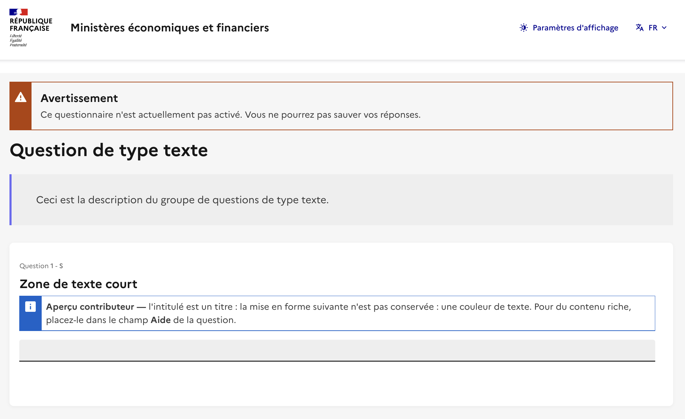

### À retenir

- La conformité RGAA et l'usage du DSFR sont des **obligations légales** — le thème en respecte la part **technique et graphique pour vous**, mais la conformité finale dépend aussi de votre contenu (voir section 4 (Accessibilité éditoriale)).
- Vous ne gérez **pas la présentation** : concentrez-vous sur le **sens** et la **structure** du questionnaire.
- **Libellé de question = titre court**, **aide = contenu riche** (voir section 3 (Créer un questionnaire)).
- Les composants DSFR ont un **sens éditorial**, jamais décoratif (voir section 6 (Mises en forme et composants DSFR)).

---

## 2. Gérer les options du thème

Le thème DSFR expose un ensemble d'**options** que vous réglez depuis l'administration de LimeSurvey, sans toucher au code. Ces réglages pilotent l'apparence (largeur d'affichage, mode sombre), l'en-tête et le pied de page (logos, titres, liens légaux) et des comportements de conformité (mise en forme automatique des contenus, protection anti-bot). Cette section les passe **toutes en revue**, onglet par onglet.

> **Où trouver ces options ?** Elles se règlent **questionnaire par questionnaire**. Ouvrez votre questionnaire, puis **Paramètres › Options de thème du questionnaire**, et cliquez sur **« Personnaliser le thème »** pour pouvoir les modifier. Les réglages sont répartis en onglets. Par défaut, chaque option **hérite** d'une valeur globale déjà conforme : vous n'ajustez que ce qui concerne votre questionnaire. Vérifiez toujours l'effet en **prévisualisation** (voir la section 7 (Prévisualiser et vérifier)).

Pour chaque option : son **rôle**, sa **valeur par défaut**, **quand la changer**, et son **impact accessibilité / DSFR**. Les valeurs par défaut sont pensées pour être conformes : ne les modifiez qu'en connaissance de cause.

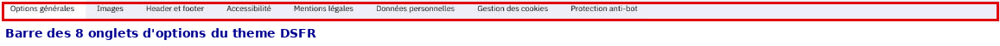

---

### Onglet « Options générales »

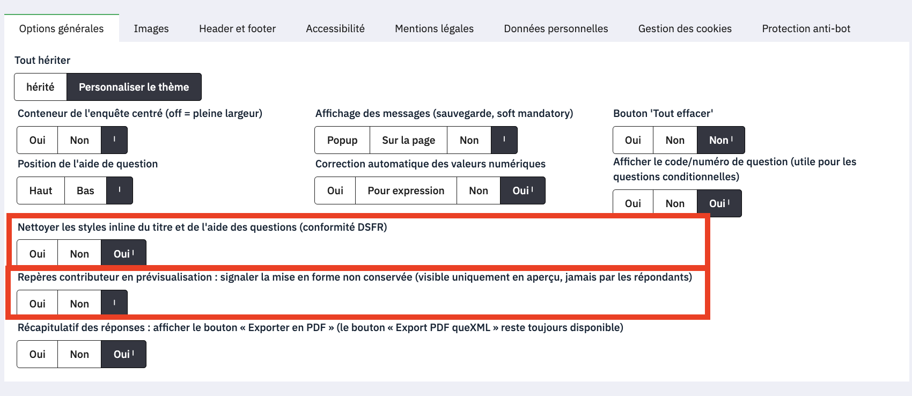

Ces options concernent la mise en page générale et le comportement du questionnaire.

#### Bouton « Tout effacer »
- **Rôle** : affiche en bas de page un bouton permettant de réinitialiser toutes les réponses.
- **Défaut** : `off`.
- **Quand la changer** : activez-le pour laisser le répondant remettre à zéro sa saisie.
- **Impact a11y/DSFR** : action destructive ; ne l'activez que si elle a un sens pour vos répondants.

#### Correction automatique des nombres
- **Rôle** : corrige la saisie numérique (virgule → point). `enable` = tous les champs numériques côté répondant ; `partial` = uniquement les calculs côté serveur ; `disable` = aucune correction.
- **Défaut** : `enable`.
- **Quand la changer** : `partial` pour ne corriger que les calculs côté serveur ; `disable` si vous voulez imposer un format de saisie strict.
- **Impact a11y/DSFR** : `enable` évite des erreurs de saisie frustrantes (virgule décimale française) — laissez-le sauf besoin précis.

#### Afficher le code de question
- **Rôle** : affiche le code/numéro de question (utile pour les questions conditionnelles, selon les réglages du questionnaire).
- **Défaut** : `on`.
- **Quand la changer** : désactivez pour masquer ces codes aux répondants.
- **Impact a11y/DSFR** : sans incidence directe ; un code technique visible peut toutefois nuire à la lisibilité pour le répondant.

#### Nettoyage des mises en forme non conformes ⭐
- **Rôle** : nettoie automatiquement les mises en forme du libellé et de l'aide des questions pour garantir la conformité DSFR.
- **Défaut** : `on`.
- **Quand la changer** : ne le désactivez **que** si vous devez volontairement conserver une mise en forme particulière dans un libellé de question ou une aide — au risque de casser la conformité DSFR.
- **Impact a11y/DSFR** : **option de conformité clé.** Elle empêche que des couleurs, tailles ou polices collées depuis Word ou un autre site ne dégradent l'accessibilité et la charte. **Laissez-la activée.** C'est le filet de sécurité qui garantit que la présentation reste normalisée quel que soit le contenu collé (voir la section 5 (Utiliser l'éditeur de texte)).

#### Repères contributeur ⭐
- **Rôle** : en **prévisualisation**, signale les mises en forme qui ne seront **pas conservées**. Ces repères sont visibles uniquement en aperçu — **jamais** par les répondants.
- **Défaut** : `on`.
- **Quand la changer** : désactivez-le pour ne plus voir ces avertissements en prévisualisation (déconseillé pendant la conception).
- **Impact a11y/DSFR** : **votre principal allié.** Ces repères vous disent, pendant que vous construisez le questionnaire, quand une mise en forme sera aplatie ou ignorée. Gardez-les activés : ils vous évitent des surprises et vous guident vers les bons composants DSFR (voir les sections 6 (Mises en forme et composants DSFR) et 7 (Prévisualiser et vérifier)).

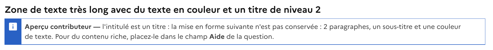

#### Export PDF du récapitulatif
- **Rôle** : affiche le bouton « Exporter en PDF » sur le récapitulatif des réponses. (Le bouton « Export PDF queXML », l'export standard de LimeSurvey, reste quant à lui toujours disponible.)
- **Défaut** : `on`.
- **Quand la changer** : désactivez pour masquer ce bouton d'export du récapitulatif.
- **Impact a11y/DSFR** : sans incidence ; simple confort pour le répondant.

---

### Onglet « Images » — Logos

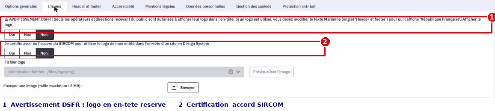

> #### ⚠️ Règle DSFR : le logo opérateur est strictement encadré
>
> Dans le Système de Design de l'État, **le bloc-marque Marianne (« République Française ») est obligatoire et suffit** pour la majorité des sites. Le **logo d'un opérateur** (établissement public, direction) ne peut être ajouté que si votre entité **y est autorisée** — typiquement les opérateurs et directions **recevant du public**.
>
> **Deux conditions cumulatives** avant d'activer un logo opérateur :
> 1. votre entité est **autorisée** à afficher son logo dans l'en-tête d'un site en Design System ;
> 2. vous avez obtenu et attestez la **certification / l'accord du SIRCOM** (option `brandlogo_sircom_certified`).
>
> Et une règle d'affichage : **dès qu'un logo opérateur est présent**, le texte du bloc-marque Marianne (`marianne_text`, onglet Header et footer) **doit afficher « République Française »**. En cas de doute, n'activez pas le logo : le bloc-marque seul est toujours conforme.

#### Activer le logo opérateur
- **Rôle** : active l'affichage du logo opérateur dans l'en-tête.
- **Défaut** : `off`.
- **Quand la changer** : activez **uniquement** si votre entité est autorisée (opérateur/direction recevant du public) **et** certifiée SIRCOM (voir encadré).
- **Impact a11y/DSFR** : usage réglementé du bloc-marque ; un logo affiché à tort constitue un défaut de conformité.

#### Certification SIRCOM
- **Rôle** : atteste que vous avez obtenu l'accord du SIRCOM pour utiliser le logo de l'entité dans l'en-tête d'un site en Design System.
- **Défaut** : `off`.
- **Quand la changer** : activez pour attester la certification — c'est un **prérequis** à l'usage de `brandlogo`.
- **Impact a11y/DSFR** : garde-fou de conformité ; ne cochez pas cette case sans accord réel.

#### Fichier du logo
- **Rôle** : sélectionne le fichier logo à afficher (liste déroulante ; formats PNG, JPG, GIF, ICO, SVG). Dépend de `brandlogo`.
- **Défaut** : `./files/logo.png`.
- **Quand la changer** : choisissez le fichier logo de votre entité. **Taille recommandée : 96 px de hauteur.**
- **Impact a11y/DSFR** : privilégiez un **SVG** (net à toute taille) et un logo lisible ; l'alternative textuelle du bloc-marque est gérée automatiquement par le thème.

---

### Onglet « Header et footer » — En-tête et pied de page

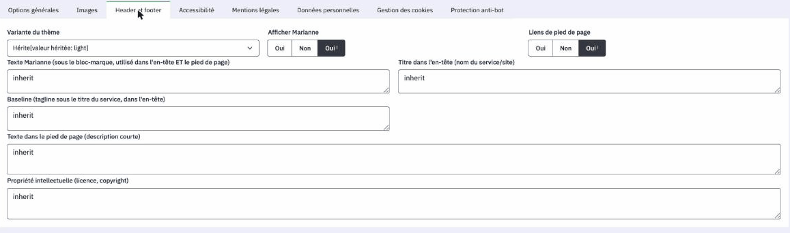

#### Schéma de couleurs par défaut
- **Rôle** : variante de couleurs par défaut : **Clair** (`light`), **Sombre** (`dark`), **Système** (`system`). Le répondant peut choisir via la modale « Paramètres d'affichage » ; **sa préférence prime** et reste mémorisée sur son appareil.
- **Défaut** : `light`.
- **Quand la changer** : `dark` pour forcer le sombre par défaut, `system` pour suivre le réglage d'affichage clair/sombre du système du répondant.
- **Impact a11y/DSFR** : les trois schémas sont conformes ; laisser le choix au répondant est une bonne pratique d'accessibilité (déjà assuré par la modale).

#### Afficher la Marianne
- **Rôle** : affiche le logo Marianne du bloc-marque.
- **Défaut** : `on`.
- **Quand la changer** : **rarement** désactivé ; laissez `on` pour la conformité DSFR de l'État.
- **Impact a11y/DSFR** : le bloc-marque est un élément **obligatoire** du DSFR pour un site de l'État.

#### Liens du pied de page
- **Rôle** : affiche la barre de liens du pied de page (accessibilité, mentions légales, données personnelles, cookies).
- **Défaut** : `on`.
- **Quand la changer** : ne désactivez que si ces liens sont gérés ailleurs (**déconseillé**).
- **Impact a11y/DSFR** : ces liens sont **obligatoires** (accessibilité, mentions légales, données personnelles). Les masquer met votre site en défaut de conformité.

#### Texte du bloc-marque
- **Rôle** : texte sous le bloc-marque Marianne, utilisé **dans l'en-tête ET le pied de page** (zone de 2 lignes).
- **Défaut** : « République Française » (réparti sur deux lignes).
- **Quand la changer** : **doit** afficher « République Française » dès qu'un logo opérateur (`brandlogo`) est présent (voir encadré Images).
- **Impact a11y/DSFR** : élément normé du bloc-marque ; conservez le libellé officiel.

#### Titre du service
- **Rôle** : titre du service/site affiché dans l'en-tête (zone de 2 lignes).
- **Défaut** : `Ministères économiques et financiers`.
- **Quand la changer** : renseignez le nom du service ou du site propre à votre questionnaire.
- **Impact a11y/DSFR** : c'est le repère d'identification principal ; soyez explicite et concis.

#### Baseline
- **Rôle** : accroche affichée sous le titre du service, dans l'en-tête (zone de 2 lignes).
- **Défaut** : vide.
- **Quand la changer** : renseignez pour afficher une accroche sous le titre du service.
- **Impact a11y/DSFR** : facultatif ; gardez-la courte.

#### Texte du pied de page
- **Rôle** : texte libre / description courte dans le pied de page (zone de 3 lignes).
- **Défaut** : « galileo.finances.gouv.fr est le service en ligne destiné aux enquêtes et formulaires en ligne des ministères économiques et financiers ».
- **Quand la changer** : adaptez au service qui édite le questionnaire.
- **Impact a11y/DSFR** : contenu éditorial ; texte clair et sans jargon.

#### Propriété intellectuelle
- **Rôle** : mention de propriété intellectuelle (licence, copyright ; zone de 3 lignes). **Réutilisée dans les mentions légales auto-générées.**
- **Défaut** : « Sauf mention explicite de propriété intellectuelle détenue par des tiers, les contenus de ce site sont proposés sous licence etalab-2.0 ».
- **Quand la changer** : adaptez si la licence ou le copyright diffère.
- **Impact a11y/DSFR** : mention légale ; veillez à son exactitude.

---

### Onglet « Accessibilité »

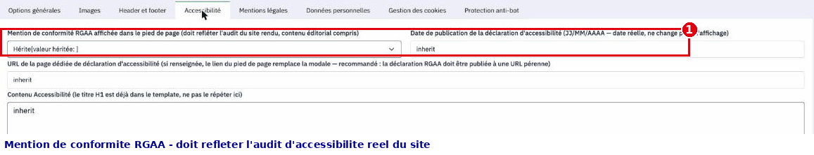

Ces options alimentent la **déclaration d'accessibilité** obligatoire et la mention affichée en pied de page. À ne modifier que dans le cas où vous réalisez un audit spécifique de votre formulaire.

#### Niveau de conformité RGAA
- **Rôle** : mention affichée en pied de page : **Totalement**, **Partiellement** ou **Non** conforme.
- **Défaut** : `totalement`.
- **Quand la changer** : Si vous réalisez un audit de votre formulaire, indiquez les résultats de l'audit.

> #### ⚠️ Déclaration d'accessibilité
>
> Le thème prend en charge la part **technique et graphique** de l'accessibilité (contrastes, focus, structure des composants) ; mais la conformité RGAA **légale** dépend **aussi** de votre contenu éditorial (libellés, images, liens), qui reste votre responsabilité. Le thème **vous met sur de bons rails, il ne signe pas l'audit à votre place.**

#### Date de la déclaration
- **Rôle** : date de publication de la déclaration d'accessibilité (format JJ/MM/AAAA ; date réelle, figée, elle n'évolue pas à l'affichage).
- **Défaut** : vide.

#### URL de la déclaration
- **Rôle** : URL de la page dédiée de déclaration d'accessibilité. Si renseignée, le lien du pied de page **remplace la modale**.
- **Défaut** : vide.

#### Contenu de la modale
- **Rôle** : contenu affiché dans la modale « Accessibilité » (déclaration type ; zone de 40 lignes). Le titre principal est déjà fourni automatiquement.
- **Défaut** : vide.

---

### Onglet « Mentions légales »

Ces champs **génèrent automatiquement** les mentions légales. Un certain nombre de champs **sont vides par défaut et doivent être renseignés**

#### Éditeur
- **Rôle** : nom, adresse, SIRET, contact (zone de 5 lignes). Sert à la génération auto.
- **Défaut** : vide. — **À renseigner**

#### Directeur de publication
- **Rôle** : nom, fonction (zone de 3 lignes). Sert à la génération auto.
- **Défaut** : vide. — **À renseigner**

#### Hébergeur
- **Rôle** : nom, adresse, téléphone (zone de 3 lignes). Sert à la génération auto.
- **Défaut** : vide. — **À renseigner**

#### Mentions légales personnalisées
- **Rôle** : contenu personnalisé (zone de 10 lignes). **Si rempli, il remplace entièrement** le contenu par défaut, et les champs ci-dessus sont **ignorés**.
- **Défaut** : vide. — **À renseigner**

---

### Onglet « Données personnelles »

Ces champs **génèrent automatiquement** la politique de confidentialité (RGPD).

#### Responsable de traitement
- **Rôle** : nom, organisme, contact (zone de 3 lignes). Sert à la génération auto.
- **Défaut** : vide. — **À renseigner**

#### Finalité
- **Rôle** : finalité/objectif du questionnaire (zone de 3 lignes). Sert à la génération auto.
- **Défaut** : vide. — **À renseigner**

#### Durée de conservation
- **Rôle** : durée de conservation des données (ex. « 12 mois »). Sert à la génération auto.
- **Défaut** : vide. — **À renseigner**

#### Contact DPO / RGPD
- **Rôle** : email du DPO ou référent RGPD. Sert à la génération auto.
- **Défaut** : vide. — **À renseigner**

#### Politique personnalisée
- **Rôle** : contenu personnalisé (zone de 10 lignes). **Si rempli, il remplace entièrement** la génération auto (responsable, finalité, base légale, destinataires, durée, droits, contact, réclamation CNIL).
- **Défaut** : vide. — **À renseigner**

---

### Onglet « Gestion des cookies »

#### Contenu de la modale cookies
- **Rôle** : contenu de la modale « Gestion des cookies » (zone de 10 lignes). Le titre principal est déjà fourni automatiquement.
- **Défaut** : Mention minimales sur les cookies de session (exemptés de consentement)

---

### Onglet « Protection anti-bot »

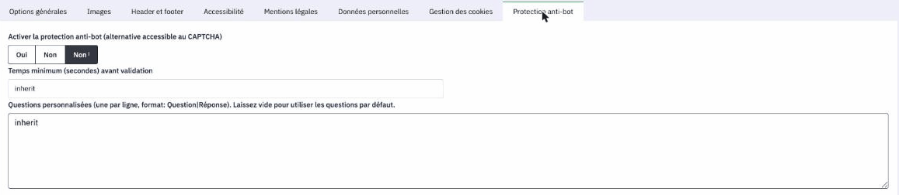

> **Pourquoi pas un CAPTCHA ?** Le CAPTCHA natif de LimeSurvey n'est **pas conforme RGAA** : le CAPTCHA image natif ne fournit **pas d'alternative accessible** (texte ou audio) et constitue donc un obstacle contraire au RGAA. Cette protection le remplace par un **défi texte accessible**, intégré dans le flot normal du questionnaire.

#### Activer la protection
- **Rôle** : active la protection anti-bot (alternative accessible au CAPTCHA).
- **Défaut** : `off`.
- **Quand la changer** : activez pour protéger un questionnaire **public** des soumissions automatisées sans casser l'accessibilité.
- **Impact a11y/DSFR** : solution **accessible** par conception ; **nettement plus accessible qu'un CAPTCHA image, mais à concevoir avec soin** (voir les défis ci-dessous). À préférer systématiquement au CAPTCHA.

#### Délai minimum
- **Rôle** : temps minimum (en secondes) avant validation.
- **Défaut** : `2`.
- **Quand la changer** : augmentez (max conseillé **10 s**) pour renforcer la protection ; **minimum conseillé 2 s** pour ne pas gêner les humains rapides.
- **Impact a11y/DSFR** : un délai **ne doit jamais être la seule barrière** — combinez-le avec un défi texte. Un délai trop long peut par ailleurs pénaliser certains répondants ; restez dans la fourchette 2–10 s.

#### Questions personnalisées
- **Rôle** : vos propres défis, **une par ligne** au format `Question|Réponse` (zone de 8 lignes). Vide = **15 questions par défaut** du thème ; rempli = **uniquement** vos questions personnalisées.
- **Défaut** : vide.
- **Quand la changer** : renseignez pour remplacer les questions par défaut par vos propres défis texte.
- **Impact a11y/DSFR** : rédigez des défis **simples, factuels et non calculatoires** (ex. `Quelle est la couleur du ciel par temps clair ?|bleu`) plutôt que de l'arithmétique, et évitez les questions culturellement marquées, pour rester accessibles.

---

### En résumé

- Deux options veillent en permanence sur la conformité : **Nettoyer les styles inline du titre et de l'aide des questions** (nettoie les mises en forme collées) et **Repères contributeur en prévisualisation** (vous prévient en aperçu). **Laissez-les activées.**
- Réglez **si possible** le niveau de conformité RGAA  sur votre valeur **réelle avant activation** : la valeur par défaut « Totalement conforme » est **juridiquement fragile** sans audit (voir la section 7 (Prévisualiser et vérifier)).
- Le **logo opérateur** est réservé aux entités autorisées et certifiées SIRCOM ; en cas de doute, le **bloc-marque Marianne seul suffit et reste toujours conforme**.
- Les onglets **Accessibilité, Mentions légales, Données personnelles, Cookies** alimentent des pages **obligatoires** : renseignez-les, et laissez la **génération automatique** faire le travail sauf besoin de surcharge totale.
- Après tout changement, **prévisualisez** (voir la section 7 (Prévisualiser et vérifier)) pour vérifier le rendu.

---

## 3. Créer un questionnaire

Créer un bon questionnaire, ce n'est pas d'abord une affaire de mise en forme : le thème DSFR s'occupe automatiquement de la présentation, des couleurs, des espacements et de l'accessibilité. Votre travail à vous, gestionnaire d'enquête, porte sur le **sens** : quelles questions poser, dans quel ordre, comment les regrouper, et comment formuler chaque libellé de question pour qu'il soit clair. Cette section vous donne les repères pour structurer votre questionnaire et pour bien distinguer ce qui va dans le **libellé de question** de ce qui va dans l'**aide**.

### 3.1 Découper en pages et groupes, ou regrouper ?

Dans LimeSurvey, un questionnaire est organisé en **groupes de questions**. Selon le mode d'affichage choisi pour le questionnaire, un groupe peut correspondre à une **page** (mode « groupe par groupe ») ou toutes les questions peuvent défiler sur une seule page. La façon dont vous découpez influence directement le confort du répondant.

**Découpez en plusieurs groupes / pages quand :**

- **La charge cognitive est trop forte.** Une page qui aligne 30 questions décourage. Regroupez par thème (ex. « Vos coordonnées », « Votre expérience du service », « Vos suggestions ») pour que le répondant avance par étapes courtes et compréhensibles.
- **Il y a une logique conditionnelle.** Si certaines questions ne doivent apparaître qu'en fonction d'une réponse précédente (conditions / « logique de branchement »), placez la question déclencheuse et les questions dépendantes de façon à ce que le filtrage soit lisible. Un découpage par page permet à LimeSurvey de calculer les conditions entre deux écrans, ce qui évite les affichages qui « sautent » sous les yeux du répondant.
- **Les thèmes sont hétérogènes.** Changer brutalement de sujet au milieu d'une page perd le répondant. Un nouveau groupe = un nouveau contexte annoncé clairement.

**Regroupez sur une même page quand :**

- Les questions forment un **tout indissociable** et court (ex. nom + prénom + email d'un même bloc « identité »).
- Les questions sont **très liées entre elles** et se répondent d'un coup d'œil, sans effort ni saut logique.
- Multiplier les pages ajouterait des clics inutiles pour peu de contenu.

> **Règle simple :** un groupe = une idée, un moment du parcours. Si vous ne savez pas nommer le groupe en quelques mots, c'est souvent qu'il en contient trop.

### 3.2 Libellé de question ou aide : où mettre quoi ?

C'est la distinction la plus importante à retenir, car le thème DSFR l'exploite pour produire une hiérarchie de titres accessible (RGAA).

#### Le LIBELLÉ DE QUESTION = un titre court

Le **libellé de question** est traité comme un **titre de niveau 3**. Le thème l'**aplatit** : il en fait un texte de titre, court et clair. Vous devez donc :

- Écrire une **phrase ou un groupe de mots concis**, qui énonce ce qu'on demande.
- **Éviter d'y mettre de la mise en forme riche** (listes, paragraphes multiples, tableaux, encadrés) : elle serait aplatie et perdue, puisqu'un titre ne peut pas contenir ce type de contenu.
- Ne pas y glisser de longues explications, d'exemples ou de consignes détaillées.

**Exemples de bons libellés de question :**

- « Quel est votre niveau de satisfaction global ? »
- « Dans quelle commune résidez-vous ? »
- « Souhaitez-vous être recontacté ? »

**Exemple à éviter (trop long, à découper) :**

> « Merci d'indiquer votre niveau de satisfaction global concernant l'accueil, en tenant compte du délai d'attente, de la clarté des informations reçues et de la disponibilité des agents, sachant que… »

Ici, seule la question doit rester dans le libellé (« Quel est votre niveau de satisfaction global concernant l'accueil ? ») ; tout le reste part dans l'aide.

#### L'AIDE = le contenu riche

Le champ **aide** (ou **texte d'aide**) est l'endroit prévu pour tout ce qui est **long ou structuré** :

- Les **précisions et consignes** (« Cochez toutes les réponses qui s'appliquent »).
- Les **exemples**, définitions, contexte.
- Les **contenus mis en forme** : listes à puces, paragraphes, et les **composants DSFR** décrits en section 6 (Mises en forme et composants DSFR) : accordéon pour une information repliable, mise en avant, etc.

Autrement dit : **le titre pose la question, l'aide l'explique.** Si vous vous surprenez à vouloir mettre en gras ou en liste quelque chose dans le libellé de question, c'est le signal que ce contenu doit descendre dans l'aide.

| Vous voulez… | Champ à utiliser |
| --- | --- |
| Poser la question elle-même | **Libellé de question** (titre court) |
| Donner une consigne de remplissage | **Aide** |
| Ajouter un exemple, une définition | **Aide** |
| Mettre une liste, un encadré, un accordéon | **Aide** |

### 3.3 Les repères contributeur en prévisualisation

Quand vous prévisualisez votre questionnaire, le thème affiche des **repères réservés au contributeur** : des encarts bleus « **Aperçu contributeur** », attachés aux questions concernées, qui signalent qu'une mise en forme ne sera **pas conservée** à l'affichage. Ce sont des aides à la conception : elles **n'apparaissent jamais** pour le répondant final (elles sont pilotées par l'option `contributor_hints`, voir la section 2).

Chaque repère dit précisément ce qui pose problème et où placer le contenu à la place. Par exemple, si vous avez collé des paragraphes, un sous-titre ou une couleur de texte dans un **libellé** de question, le repère indique : « *l'intitulé est un titre : la mise en forme suivante n'est pas conservée : 2 paragraphes, un sous-titre et une couleur de texte. Pour du contenu riche, placez-le dans le champ Aide de la question.* »

**Ce que cela change pour vous :**

- Ne vous inquiétez pas de la présence de ces encarts : ils **disparaissent** dans la version réellement diffusée.
- Servez-vous-en comme d'un **garde-fou** : chaque repère vous dit, pendant la conception, quelle mise en forme sera neutralisée et quoi faire à la place (le plus souvent : déplacer le contenu riche dans le champ **Aide**).
- Pour juger du rendu final tel que le verra le répondant, reportez-vous à la section 7 (Prévisualiser et vérifier), qui explique comment lire l'aperçu et ce qu'il faut contrôler.

> **À retenir :** structurez d'abord (groupes, ordre, conditions), formulez ensuite (libellé de question court en titre, contenu riche en aide), et laissez le thème DSFR gérer toute la présentation à votre place.

---

## 4. Accessibilité éditoriale (RGAA au quotidien)

Le thème et les composants DSFR prennent déjà en charge la part **technique et graphique** de l'accessibilité (contrastes, focus clavier, structure des composants). Mais aucun thème ne peut corriger un **contenu mal rédigé** : un lien nommé « cliquez ici », une image sans description utile ou un faux titre en gras restent des obstacles pour les personnes qui utilisent un lecteur d'écran, naviguent au clavier ou distinguent mal les couleurs. Autrement dit, le thème vous met sur de bons rails, il ne signe pas l'audit à votre place : la conformité RGAA légale dépend **aussi** de votre contenu éditorial.

Cette section rassemble les cinq gestes éditoriaux qui relèvent de **vous, gestionnaire d'enquête**, et que personne ne fera à votre place. Aucun ne demande de compétence technique : ce sont des réflexes de rédaction.

> Règle de fond : **la mise en forme sert le sens, jamais l'inverse.** Chaque fois que vous voulez « faire ressortir » quelque chose, demandez-vous *ce que ça veut dire*, puis choisissez le composant qui porte ce sens (voir Annexe B). Ne simulez jamais une intention par un simple effet visuel.

### 4.1. Des intitulés de liens explicites

Un lecteur d'écran peut lister tous les liens d'une page, **sortis de leur contexte**. Si trois liens s'appellent tous « cliquez ici » ou « en savoir plus », la liste est inutilisable. L'intitulé du lien doit décrire **sa destination**, à lui seul.

| À éviter | À écrire |
|---|---|
| Pour la notice, **cliquez ici**. | Consultez la **notice d'aide au remplissage**. |
| Le règlement est disponible **ici**. | Lire le **règlement de l'enquête**. |
| **En savoir plus** sur la RGPD. | En savoir plus sur **la protection de vos données**. |

Bons réflexes :

- L'intitulé doit rester compréhensible **hors contexte** : « Règlement de l'enquête 2026 » plutôt que « ce document ».
- Ne collez pas l'adresse web brute comme texte de lien : illisible à l'oral.
- **Fichier à télécharger ≠ lien vers une page.** Si le clic ouvre une page web, c'est un lien standard. Si le clic récupère un fichier (PDF, tableur…), utilisez le composant **Téléchargement de fichier** : il annonce le nom du document, son format et son poids *avant* le clic (« Notice d'aide au remplissage — PDF, 1,7 Mo »). Là encore, l'intitulé décrit **le document**, pas l'action : « Notice d'aide », jamais « Télécharger » ni « Cliquez ici ».

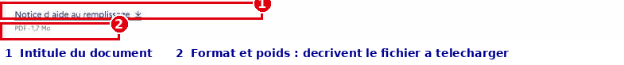

### 4.2. Des alternatives d'images pertinentes

Toute image porteuse d'information a besoin d'une **alternative textuelle** (texte remplaçant l'image pour qui ne la voit pas). L'éditeur vous demande ce texte au moment de l'insertion.

Le bon réflexe : écrivez ce que vous **diriez à voix haute** à quelqu'un qui ne voit pas l'écran, en vous concentrant sur *l'information utile dans le contexte du questionnaire*.

- **Image informative** → décrivez l'information : « Schéma des 4 étapes du parcours de demande d'aide ».
- **Image purement décorative** (fioriture, séparateur) → laissez l'alternative **vide** pour que le lecteur d'écran l'ignore, plutôt que d'annoncer un nom de fichier parasite.
- **Ne mettez jamais un texte important dans une image.** Un titre, une consigne ou un tableau glissés sous forme d'image deviennent invisibles pour les lecteurs d'écran, illisibles au zoom et introuvables par recherche. Un tableau se fait avec le composant **Tableau**, une consigne avec du vrai texte.
- Évitez les alternatives creuses : « image », « photo », « logo.png » n'apportent rien.

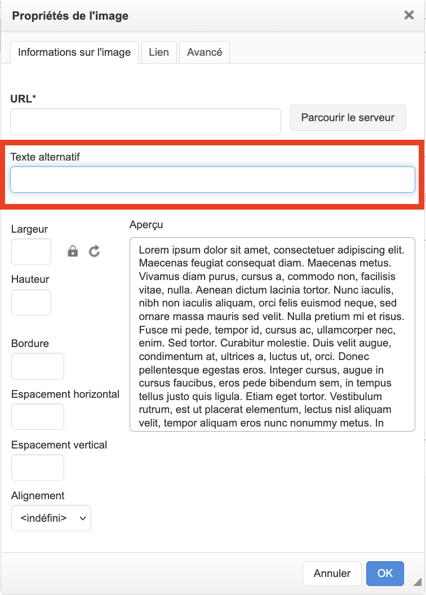

### 4.3. Une hiérarchie de titres cohérente

Les titres forment le **plan** de la page. Les personnes qui utilisent un lecteur d'écran naviguent de titre en titre : si la hiérarchie est incohérente, elles se perdent.

La bonne nouvelle : dans un questionnaire, **cette hiérarchie est déjà construite pour vous**. Le titre du questionnaire, les titres de groupe et chaque **libellé de question** (rendu comme un titre de niveau 3, voir la section 3) s'emboîtent automatiquement, sans saut de niveau. Vous n'avez donc **pas de titres à créer** — seulement deux règles à respecter :

1. **Ne cassez pas le plan existant.** Laissez la structure porter les titres : un nouveau sujet = un nouveau groupe (avec son titre), une nouvelle question = un libellé court. Ne « sous-titrez » pas une page en insérant des phrases-titres dans les textes.
2. **Un titre est un titre — pas du gras.** Ne simulez **jamais** un titre en mettant une phrase en **gras** ou en MAJUSCULES : visuellement ça ressemble à un titre, mais pour un lecteur d'écran ce n'est que du texte ordinaire, sans rôle de structure.

Et si une **aide** devient longue au point d'appeler des sous-titres ? C'est le signal qu'il faut **restructurer** : découper en plusieurs questions ou groupes, ou replier le contenu secondaire dans un **accordéon** — son en-tête joue alors le rôle de titre, correctement structuré (voir la section 6 (Mises en forme et composants DSFR)). L'éditeur ne propose volontairement pas de menu de niveaux de titre ; si un cas exceptionnel en exigeait un, demandez à votre **référent thème / webmestre**.

### 4.4. Ne jamais faire porter le sens par la seule couleur

Environ 8,5 % de la population perçoit mal certaines couleurs, et un lecteur d'écran n'annonce aucune couleur. Une information transmise **uniquement** par la couleur est donc perdue pour une partie du public.

- N'écrivez pas « les champs en rouge sont obligatoires » : ajoutez une mention texte. Le caractère obligatoire d'une question est d'ailleurs signalé **nativement** par LimeSurvey (astérisque et mention), pas seulement par une couleur — vous n'avez rien à ajouter à la main.
- Ne dites pas « voir l'encadré vert / la partie orange » : nommez le contenu, pas sa couleur.
- Les composants DSFR respectent déjà ce principe, à condition de **les employer pour leur sens** :
  - Un **Badge** de statut doit rester compréhensible par son texte seul : le libellé « Clôturée » suffit, la couleur ne fait que renforcer. Ne comptez jamais sur la seule pastille colorée.
  - Une **Alerte** possède un type (information, succès, avertissement…) : choisissez-le pour **ce qu'il signifie**, pas pour sa couleur. Une alerte « rouge parce que ça se voit » alarme à tort ; un succès présenté comme une simple information brouille le message. L'alerte est faite pour être **lue immédiatement, sans que le répondant ait à agir** — ne la remplacez pas par un accordéon, qui replie le contenu.

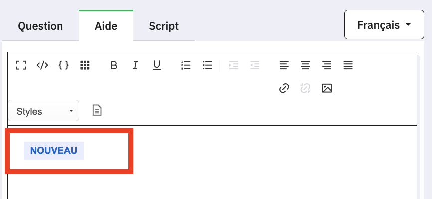

### 4.5. Une langue claire

L'accessibilité, c'est aussi la **compréhension**. Vos répondants ne connaissent ni votre jargon métier ni les sigles internes.

- Phrases courtes, une idée par phrase, vocabulaire courant.
- **Développez les sigles** à leur première apparition : « le RSA (revenu de solidarité active) ».
- Formulez les consignes à l'impératif et de façon concrète : « Indiquez votre date de naissance » plutôt que « Une saisie de la date de naissance est requise ».
- Un vocabulaire de statut **stable** : dites toujours « Clôturée », jamais tantôt « Fermée » tantôt « Terminée ». La cohérence aide tout le monde, en particulier les personnes en situation de handicap cognitif.
- Si votre questionnaire mélange plusieurs langues (un document en anglais, une citation étrangère), la langue de ce passage doit être signalée pour que le lecteur d'écran le prononce correctement. Ce marquage est une opération technique : ne le faites pas vous-même, **demandez-le à votre référent thème / webmestre**.

### 4.6. À retenir

| Le réflexe | Pourquoi | Le bon composant / geste |
|---|---|---|
| Intitulés de liens explicites | Compréhensibles hors contexte | Décrire la destination ; **Téléchargement de fichier** pour un fichier |
| Alternatives d'images utiles | L'information passe sans la vue | Décrire l'info ; alternative vide si décoratif ; jamais de texte en image |
| Hiérarchie de titres | Un plan navigable | Laisser la structure porter les titres (groupes, libellés) ; jamais de faux titre en gras |
| Sens jamais porté par la couleur seule | Daltonisme, lecteurs d'écran | Texte + couleur ; **Badge** lisible par son libellé, **Alerte** typée par son sens |
| Langue claire | Compréhension de tous | Phrases courtes, sigles développés, vocabulaire cohérent |

---

## 5. Utiliser l'éditeur de texte

Chaque fois que vous saisissez un libellé de question, un texte d'aide, une introduction de groupe ou un message de fin, LimeSurvey vous ouvre le même éditeur de texte enrichi. C'est là que se joue l'essentiel de votre travail éditorial. Cette section fait le tour de l'outil et, surtout, clarifie **ce que vous pouvez faire, ce que vous devez éviter, et pourquoi**.

Le principe à garder en tête : **vous vous occupez du sens, le thème s'occupe de la présentation.** Vous n'avez donc jamais à régler une couleur, une taille de police ou une graisse « à la main » : la mise en forme conforme (RGAA + DSFR) est appliquée automatiquement. Ce que vous saisissez qui sortirait du cadre est simplement neutralisé **à l'affichage** — dans l'aperçu comme pour le répondant. Ce n'est pas un défaut, c'est la conformité qui fait son travail.

### 5.1. Deux barres d'outils : la simple et la complète

L'éditeur s'ouvre par défaut sur une **barre d'outils simple** (une seule ligne d'icônes : les mises en forme de base). Un **bouton de bascule** de la barre permet de l'agrandir en **barre complète**, qui déploie davantage d'options — dont les deux menus qui vous serviront le plus pour le DSFR : le menu **Styles** et la palette **Modèles** (bouton *Templates* de l'éditeur). Un nouvel appui sur le même bouton referme la barre.

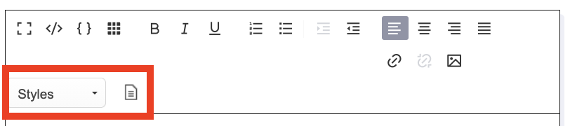

Retenez :

- **Barre simple** — pour un texte court sans mise en forme particulière (la plupart des **libellés de question**).
- **Barre complète** — dès que vous voulez une liste, un lien, ou un composant DSFR (le plus souvent dans un **texte d'aide** ou une **introduction de groupe**). C'est aussi là que se trouvent les menus **Styles** et **Modèles**, détaillés à la section 6 (Mises en forme et composants DSFR).

> À noter : les menus **Styles** et **Modèles** sont présents dans la barre complète, quelle que soit la barre par laquelle vous avez commencé. Si vous ne les voyez pas, c'est que vous êtes en barre simple : cliquez sur le bouton de bascule.

### 5.2. Ce que vous pouvez utiliser sans crainte

Ces mises en forme, appliquées **via les boutons de l'éditeur**, sont **conservées** telles quelles à l'affichage, parce qu'elles portent un sens et restent compatibles avec le DSFR :

- **Gras** et *italique* — pour accentuer un mot important (avec parcimonie : tout mettre en gras n'accentue plus rien).
- **Souligné** — possible, mais attention : sur le web, le souligné évoque un lien. Réservez-le aux cas où il apporte vraiment quelque chose.
- **Listes à puces** et **listes numérotées** — idéales pour énumérer des critères, des étapes, des exemples. Préférez toujours une vraie liste à des tirets tapés à la main : c'est plus lisible et mieux restitué par les lecteurs d'écran.
- **Liens** — vers une page d'information, une notice, une définition. Rédigez un libellé de lien **explicite** (voir la section 4 (Accessibilité éditoriale)) : jamais « cliquez ici ».
- **Exposant** — utile pour « m² », « 1ᵉʳ », un appel de note, une formule simple. Conservé.

### 5.3. Ce que vous devez éviter

Ces manipulations ne servent à rien ici : soit elles sont **neutralisées** à l'affichage, soit elles introduisent des problèmes invisibles.

- **Couleurs de texte, tailles de police, changement de police** — même si un bouton semble le permettre, ces réglages manuels sont **retirés au moment de l'affichage** pour garantir la conformité et la cohérence visuelle : votre saisie reste enregistrée telle quelle, mais le thème neutralise ces styles au rendu, dans l'aperçu comme pour le répondant. Le contraste, la taille et la typographie sont déjà gérés par le thème DSFR. Vouloir « mettre un mot en rouge » ne fonctionnera pas ; pour signaler quelque chose d'important, utilisez plutôt un composant DSFR qui porte ce sens (une **mise en avant** ou une **alerte**, voir la section 6 (Mises en forme et composants DSFR)).
- **Alignements et espacements manuels** — centrer ou justifier un paragraphe, forcer des marges : ces réglages sont eux aussi retirés à l'affichage. La mise en page (alignements, espacements, interlignes) est entièrement prise en charge par le DSFR.
- **Coller depuis Word (ou un PDF, un e-mail mis en forme)** — le copier-coller depuis un traitement de texte embarque un « bagage » caché de balises et de styles propriétaires. Résultat : espacements bizarres, polices qui sautent, listes cassées, et beaucoup de nettoyage. **Le bon réflexe : coller le texte, puis reconstruire la mise en forme dans l'éditeur** (listes, gras, liens). Pour coller du texte pur, utilisez le collage sans mise en forme de votre système (Ctrl+Maj+V / Cmd+Maj+V) avant de re-styler.

> Pourquoi c'est retiré et pas juste « déconseillé » ? Parce que la présentation est **normalisée pour vous** : c'est une obligation légale d'accessibilité (RGAA) et de charte (DSFR). L'éditeur vous laisse vous concentrer sur le fond ; il fait le tri sur la forme.

### 5.4. Le mode code (source) : à laisser au référent

La barre complète peut donner accès à un **mode « code » (ou « source »)**, qui affiche le contenu sous sa forme technique. En tant que gestionnaire, **vous n'en avez pas besoin** : tout ce que décrit ce guide se fait dans l'éditeur visuel. Ce mode ne concerne que des cas très particuliers — par exemple insérer une **équation** ou une **formule** mathématique que l'éditeur visuel ne sait pas saisir.

Si vous êtes dans ce cas, **ne modifiez rien vous-même** : demandez à votre **référent thème / webmestre**. Une manipulation approximative à cet endroit peut casser l'affichage de la question côté répondant, sans que vous vous en rendiez compte.

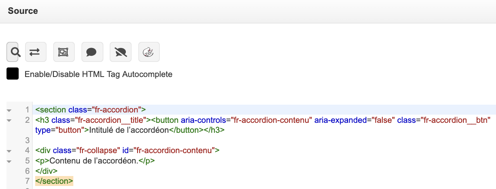

### 5.5. Récapitulatif : conservé ou normalisé

| Ce que vous faites | Résultat à l'affichage |
| --- | --- |
| Gras, italique, souligné (boutons de l'éditeur) | ✅ Conservé |
| Liste à puces / numérotée | ✅ Conservé |
| Lien (avec libellé explicite) | ✅ Conservé |
| Exposant | ✅ Conservé |
| Style DSFR (menu **Styles**) ou composant (palette **Modèles**) | ✅ Conservé |
| Couleur de texte manuelle | 🚫 Retirée |
| Taille de police manuelle | 🚫 Retirée |
| Changement de police manuel | 🚫 Retiré |
| Alignement manuel (centré, justifié) | 🚫 Retiré |
| Mise en forme collée depuis Word | ⚠️ Nettoyée / imprévisible — à reconstruire |

> « Retiré » signifie que votre saisie reste enregistrée, mais que le thème la neutralise **au moment du rendu**, dans l'aperçu comme sur le questionnaire diffusé. En prévisualisation, les **repères contributeur** (voir les sections 2 et 3) vous signalent précisément ce qui ne sera pas conservé.

En résumé : servez-vous de l'éditeur pour **structurer** (listes, liens, accentuations utiles) et laissez le thème **habiller**. Pour tout ce qui relève de la couleur, du composant ou de la mise en valeur visuelle, passez par les menus **Styles** et **Modèles** — c'est l'objet de la section 6 (Mises en forme et composants DSFR).

---

## 6. Mises en forme et composants DSFR

C'est le cœur du guide. Le thème met à votre disposition **deux outils complémentaires**, tous deux accessibles depuis la barre d'outils de l'éditeur de texte :

- le menu déroulant **Styles**, pour mettre en forme du texte (introduction, tailles, badges) ;
- la palette **Modèles** (bouton *Templates* de l'éditeur), pour insérer des **composants DSFR** prêts à l'emploi (alerte, accordéon, tableau…).

Ces deux outils ont le même but : vous permettre d'obtenir une présentation **conforme au DSFR et au RGAA sans écrire une seule ligne de code, ni choisir une couleur « à la main »**. Vous vous concentrez sur le sens ; la mise en forme normalisée est fournie.

> **Règle absolue à garder en tête** : ces mises en forme et ces composants s'utilisent dans le champ **AIDE** d'une question (et dans les textes d'introduction ou de fin du questionnaire), **jamais dans le libellé** de la question. Le libellé de question s'affiche comme un titre : tout composant que vous y colleriez serait détruit. Voir la section 3 (Créer un questionnaire).

### 6.1. Le menu Styles : mettre en forme sans se soucier de la charte

Le menu **Styles** applique une mise en forme DSFR à votre texte. Sélectionnez d'abord le texte concerné, puis choisissez une entrée dans la liste déroulante.

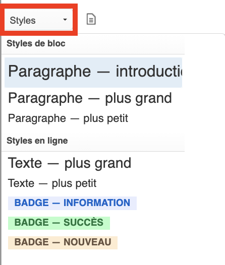

#### Pourquoi passer par Styles plutôt que par une couleur ou un agrandissement « manuel » ?

Parce que c'est **plus durable et conforme**. Quand vous mettez un mot en rouge ou que vous forcez une taille de police à la main, le thème **nettoie automatiquement** ces réglages : votre effort disparaît à l'affichage. Les **entrées du menu Styles, elles, sont conservées**. Autrement dit :

- une couleur choisie à la main = risque de disparaître, et souvent **non conforme** (contraste insuffisant, sens porté par la seule couleur) ;
- un style du menu Styles = **conservé, lisible, accessible**, et cohérent avec le reste des sites de l'État.

#### Les styles disponibles

| Style | Effet | Quand l'utiliser |
| --- | --- | --- |
| **Paragraphe — introduction** | Paragraphe en plus gros, ton « chapô » | La phrase d'accroche en tête d'une introduction |
| **Paragraphe — plus grand** / **plus petit** | Ajuste la taille d'un paragraphe entier | Aérer ou hiérarchiser un bloc de texte |
| **Texte — plus grand** / **plus petit** | Ajuste la taille de quelques mots sélectionnés | Nuancer une portion de phrase |
| **Badge — information / succès / nouveau** | Petite pastille de statut colorée | Signaler un **statut** court (voir ci-dessous) |

#### Le badge : un marqueur de STATUT, avec parcimonie

Un **badge** est un marqueur **court et non cliquable** qui signale l'**état** d'un élément. Le menu Styles en propose **trois** : **information** (bleu), **succès** (vert) et **nouveau**. Leur couleur porte un **sens**, jamais une décoration.

- **À utiliser pour** : afficher un statut factuel et stable, en un ou deux mots — par exemple « Nouveau » à côté d'une nouvelle rubrique, « Brouillon » ou « Clôturée » pour qualifier l'état d'un questionnaire.
- **À NE PAS utiliser pour** :
  - délivrer un **message d'état important** que le répondant doit voir → c'est le rôle d'une **alerte** ;
  - en faire un **bouton ou un lien** : un badge n'est pas cliquable ;
  - de la **décoration** ou de l'accroche (« Top ! ») : la couleur a un sens (succès, information…) et doit rester fiable ;
  - **marquer une question comme obligatoire** : le caractère obligatoire est déjà géré nativement par LimeSurvey (astérisque et mention), n'ajoutez pas de badge pour cela ;
  - **empiler** plusieurs badges ou y mettre une phrase.
- **Bonnes pratiques** : texte très court, sans ponctuation finale ; employez un **vocabulaire de statut cohérent** dans tout le questionnaire (voir section 4, Accessibilité éditoriale) ; ne faites **jamais reposer le sens sur la seule couleur** — le mot doit suffire à comprendre. **Employez-le avec parcimonie** : s'il y en a partout, il ne signale plus rien.

### 6.2. La palette Modèles : insérer des composants DSFR

Le bouton **Modèles** ouvre une **boîte de dialogue** (« Contenu des modèles ») listant des composants DSFR prêts à insérer. Placez le curseur là où vous voulez insérer le bloc, cliquez sur le modèle voulu : le composant s'ajoute avec un **texte d'exemple** que vous n'avez plus qu'à remplacer.

> **Attention à la case « Remplacer le contenu actuel »**, en haut de la boîte de dialogue : cochée, le modèle **remplace tout** le contenu du champ ; décochée, il **s'insère** à la position du curseur, sans rien effacer. Vérifiez-la avant de cliquer.

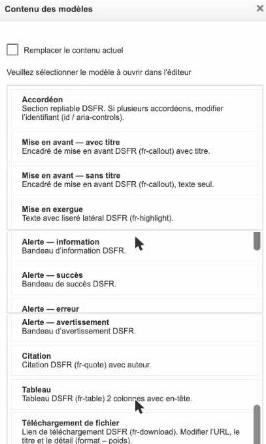

La palette propose exactement ces composants :

- **Accordéon**
- **Mise en avant — avec titre** et **Mise en avant — sans titre**
- **Mise en exergue**
- **Alerte — information / succès / erreur / avertissement**
- **Citation**
- **Tableau**
- **Téléchargement de fichier**

**Le point crucial** n'est pas de savoir *insérer* un bloc, mais de choisir **le bon composant pour le bon sens**. Chaque composant DSFR a une **signification éditoriale** : l'utiliser à contre-emploi désoriente le répondant et casse la cohérence. Voici, composant par composant, à quoi il sert — et à quoi il **ne** sert **pas**.

### 6.3. Le sens de chaque composant

#### Accordéon — du contenu secondaire, replié à la demande

Un accordéon regroupe un contenu **long ou secondaire** sous un en-tête cliquable que le répondant **déplie s'il le souhaite**. Il signale : « ceci est consultable à la demande ».

- **À utiliser pour** : une **FAQ** (chaque question repliée, on n'ouvre que la sienne) ; des **précisions méthodologiques ou réglementaires** que tout le monde n'a pas besoin de lire ; alléger une page longue sur mobile en repliant des sections **secondaires**.
- **À NE PAS utiliser pour** :
  - masquer une **information critique ou une consigne indispensable** pour répondre : ce qui est nécessaire reste **visible** ;
  - diffuser une **alerte** ou un message d'erreur/succès (→ composant **Alerte**) ;
  - afficher un **statut** court (→ **badge**) ;
  - servir de **menu de navigation** ou d'onglets ;
  - replier un texte **d'une ou deux phrases** (le pli ajoute un clic inutile).
- **Bonnes pratiques** : rédigez des **en-têtes explicites et autoporteurs** (idéalement une vraie question en FAQ) — on doit deviner le contenu sans ouvrir. Un seul panneau s'ouvre à la fois : n'y logez pas des contenus à **comparer côte à côte**. Limitez-vous à **6–8 plis** maximum (au-delà, préférez un découpage en pages) et **n'imbriquez pas** les accordéons. Ne préremplissez pas tous les panneaux ouverts.
- **Plusieurs accordéons au même endroit** : le plus simple est de **répartir les accordéons dans des aides de questions différentes**. Pour en placer plusieurs au même endroit dans une même aide, demandez à votre **référent thème / webmestre**.

#### Alerte (information / succès / erreur / avertissement) — un message d'état à voir immédiatement

L'alerte est un message qui exige l'attention **immédiate** du répondant. Le **type** encode le message et se choisit **pour ce qu'il veut dire, pas pour sa couleur** :

- **Information** (bleu) = contexte neutre (période de collecte, information de cadrage) ;
- **Succès** (vert) = quelque chose a abouti ;
- **Avertissement** (orange) = attention à une conséquence (collecte bientôt close, échéance proche) ;
- **Erreur** (rouge) = quelque chose bloque.

> **Ce que vous n'avez PAS à écrire.** Les confirmations d'enregistrement, les messages d'erreur de validation et les rappels de **champ obligatoire manquant** sont produits **automatiquement** par LimeSurvey et le thème. Ne les recopiez **jamais** « en dur » dans une aide. L'alerte que vous insérez sert aux **messages d'état statiques que vous maîtrisez**, par exemple « La collecte se termine le 30 juin ».

- **À NE PAS utiliser pour** :
  - un **encart décoratif** ou du contenu **permanent** : une alerte affichée en continu **n'alerte plus** et devient du bruit ignoré ;
  - remplacer un autre composant (un accordéon **ne remplace pas** une alerte, qui doit être vue **sans action** du répondant) ;
  - un **statut** compact (→ badge) ;
  - **empiler** des alertes de même niveau ou multiplier les couleurs.
- **Bonnes pratiques** : un **titre court** qui résume l'état, un message qui dit **quoi faire ensuite** (action concrète) plutôt que de décrire le problème ; pas de jargon. Ne choisissez **pas** le rouge « parce que ça se voit » : un faux positif inquiète inutilement. Si un message doit rester **tout le temps**, ce n'est pas une alerte mais du **contenu éditorial** (mise en avant ou mise en exergue).

#### Mise en avant — une information importante et stable

Composant qui attire l'attention sur une information **importante et utile**, complémentaire au contenu principal, **sans le caractère d'urgence** d'une alerte. Il contient un **titre et un texte**. Deux variantes : **avec titre** (mise en avant autonome) ou **sans titre** (texte seul).

- **À utiliser pour** : rappeler une **consigne clé** avant un module de questions (« Répondez en pensant aux 12 derniers mois ») ; donner un **contexte rassurant** (durée estimée, anonymat, reprise possible) ; signaler une information **notable mais non urgente**.
- **À NE PAS utiliser pour** : une **erreur / succès / info urgente** (→ Alerte) ; une **citation** (→ Citation) ; une **FAQ** repliable (→ Accordéon) ; un simple **encadré coloré « pour faire joli »**.
- **Bonnes pratiques** : sa force tient à sa **rareté** — **une, exceptionnellement deux** par page. Titre court, texte concis (2–3 phrases, **une seule idée**).

#### Mise en exergue — faire ressortir un court passage clé

La mise en exergue détache un **court passage de texte réellement important** par un **liseré vertical coloré**, sans changer son sens ni sonner l'alerte.

- **À utiliser pour** : souligner une **information clé** dans une introduction ou une consigne (« Vos réponses restent anonymes ») ; une phrase-pivot à lire avant de commencer ; aérer un texte dense en isolant l'idée directrice.
- **À NE PAS utiliser pour** : une **erreur / info critique temporaire** (→ Alerte) ; une **parole attribuée** (→ Citation) ; **décorer** la page ; encadrer de **longs blocs** ou **empiler** les exergues.
- **Bonnes pratiques** : une à trois phrases, rédigées comme un **message autoportant** ; **une seule** (au maximum deux) par écran. Évitez le gras et les majuscules à l'intérieur — le liseré suffit déjà à hiérarchiser. Dans le doute : « est-ce un état / une action à corriger ? » → **Alerte** ; « est-ce une information de fond à retenir ? » → **Mise en exergue**.

#### Citation — une parole rapportée, attribuée à son auteur

La citation met en valeur les **propos exacts** d'une personne ou l'extrait fidèle d'un texte, **en les attribuant** à leur auteur. C'est un composant de **sens** (verbatim attribué), jamais un surligneur décoratif.

- **À utiliser pour** : un **verbatim de répondant** (témoignage, réponse ouverte marquante) attribué à sa source ; une **parole officielle** (déclaration d'un responsable) ; un **extrait fidèle** d'un texte de référence dont les mots font foi.
- **À NE PAS utiliser pour** : faire ressortir un **texte ordinaire** parce qu'on le trouve « joli » encadré ; porter une **consigne ou une info critique** (→ mise en exergue ou alerte) ; **inventer ou reformuler** des propos (une citation = **mots exacts + auteur identifiable**).
- **Bonnes pratiques** : reproduisez les propos **mot pour mot** et **attribuez-les systématiquement** (nom, et si utile fonction/organisme) — une citation **sans auteur** perd son sens. Une ou deux par page suffisent. Sur des réponses au questionnaire, **anonymisez ou obtenez le consentement** avant d'attribuer nominativement.

#### Tableau — des données comparables en lignes et colonnes

Le tableau présente des **données structurées et comparables**, pour que le lecteur puisse **lire, croiser et comparer** des valeurs. Ce n'est **jamais** un outil de mise en page.

- **À utiliser pour** : des données **réellement tabulaires** (une même information déclinée sur plusieurs entrées : liste de documents avec format et date, résultats par question) ; permettre de **comparer** ligne à ligne ou colonne à colonne.
- **À NE PAS utiliser pour** : **mettre en page** des blocs visuels ; afficher une **paire clé/valeur isolée** (→ badge ou simple phrase) ; un contenu **narratif ou hiérarchique** (→ accordéon / liste) ; reproduire une **tendance** (→ un graphique serait plus lisible).
- **Bonnes pratiques** : toujours renseigner un **titre** (la légende qui annonce le contenu — le modèle contient « Titre du tableau », à remplacer) ; des **en-têtes de colonnes** courts et explicites (le modèle les fournit, à conserver) ; **évitez les cellules fusionnées** et les tableaux imbriqués qui gênent la lecture par lecteur d'écran. Sur mobile, **limitez le nombre de colonnes à l'essentiel** et laissez le défilement horizontal faire son travail. Règle d'or : si vous ne pouvez pas **nommer chaque colonne** ni justifier que les lignes se **comparent**, ce n'est pas un tableau.

#### Téléchargement de fichier — récupérer un document, format et poids annoncés

Ce composant signale et déclenche le téléchargement d'un **document** (PDF, tableur…) en annonçant **avant le clic** ce que le répondant va récupérer : **intitulé explicite, format et poids**.

- **À utiliser pour** : proposer un **fichier réel et autonome** (notice à remplir, règlement du questionnaire, courrier de consentement, récapitulatif à archiver) ; chaque fois que le répondant **récupère un fichier** sur son appareil.
- **À NE PAS utiliser pour** : un **simple lien vers une page web** (le pictogramme et la mention de poids induiraient en erreur — un renvoi vers une page relève du **lien standard**) ; un **bouton d'action** du questionnaire (« Envoyer mes réponses ») : télécharger n'est pas soumettre.
- **Règle simple** pour trancher : *si le répondant reste dans le navigateur, c'est un lien ; s'il récupère un fichier sur son appareil, c'est un composant de téléchargement.*
- **Bonnes pratiques** : le modèle inséré contient des **espaces réservés à remplacer impérativement** :
  - l'emplacement d'adresse → l'**adresse réelle** du document ;
  - « Intitulé du fichier » → un libellé **explicite et autoporteur** (« Notice d'aide au remplissage » plutôt que « Cliquez ici » ou « Télécharger ») : le libellé décrit le **document**, pas l'action ;
  - « Format – Poids » → renseignez-les **réellement** (ex. « PDF – 1,7 Mo ») : c'est une information d'**accessibilité et de confiance**, précieuse sur mobile ou faible connexion. Ne laissez **jamais** ce détail vide.

### 6.4. À retenir

- **Styles** = mise en forme de texte (intro, tailles, **badge de statut**) ; ces réglages sont **conservés**, contrairement à une couleur posée à la main.
- **Modèles** = **composants DSFR** prêts à insérer, chacun avec un **sens précis**. Le tableau ci-dessous résume les confusions les plus fréquentes :

| Vous voulez… | Utilisez | Pas… |
| --- | --- | --- |
| Afficher un **message d'état que vous maîtrisez** (ex. fin de collecte) | **Alerte** | Mise en avant, exergue, badge |
| Rappeler une **info importante et durable** | **Mise en avant** ou **Mise en exergue** | Alerte |
| Rapporter **une parole attribuée** | **Citation** | Mise en exergue |
| Replier une **info secondaire / FAQ** | **Accordéon** | Alerte |
| Afficher un **statut** en un mot | **Badge** (menu Styles) | Alerte |
| Comparer des **données** | **Tableau** | (mise en page) |
| Faire **récupérer un fichier** | **Téléchargement** | Lien standard |

- Et toujours : **ces composants vont dans l'AIDE (ou les textes d'introduction/fin), jamais dans le libellé** de la question.

---

## 7. Prévisualiser et vérifier

Avant de diffuser un questionnaire, vous devez **voir ce que verra le répondant**. L'écran d'édition de LimeSurvey affiche vos textes « à plat » (libellés de question, aides, mises en forme brutes) : ce n'est pas le rendu final. Le thème DSFR n'entre pleinement en action que dans l'aperçu et sur le questionnaire activé. La prévisualisation est donc l'étape où vous validez à la fois le **sens** (l'enchaînement des questions est clair) et la **présentation** (les composants DSFR s'affichent correctement).

Prenez cette étape au sérieux : une fois le questionnaire activé et diffusé, certaines corrections deviennent plus délicates. Mieux vaut vérifier une fois de trop.

> ### ⚠️ Vérifiez la déclaration de conformité RGAA avant activation
>
> C'est le moment de contrôler l'option de mention RGAA du thème (voir section 2, Gérer les options du thème). Sa valeur par défaut est **« Totalement conforme »** — or, tant qu'aucun audit d'accessibilité n'a été réalisé sur votre questionnaire, cette mention est **juridiquement fausse**. **Ne laissez jamais la valeur par défaut :** réglez-la sur votre niveau réel (**Non** ou **Partiellement** conforme). C'est une **étape obligatoire** avant d'activer le questionnaire. Rappel : le thème vous met sur de bons rails côté technique et graphique (contrastes, focus, structure des composants), mais la conformité RGAA légale dépend **aussi** de votre contenu éditorial — il ne signe pas l'audit à votre place.

### Trois niveaux d'aperçu

LimeSurvey vous propose trois portées de prévisualisation, de la plus fine à la plus large. Utilisez-les dans cet ordre au fil de votre travail.

- **Aperçu d'une question** — pour contrôler une question précise que vous venez de rédiger : le libellé de question s'affiche-t-il bien comme un titre court ? L'aide (avec ses éventuels composants DSFR) s'affiche-t-elle en dessous ? C'est l'aperçu du quotidien pendant la saisie.
- **Aperçu d'un groupe** — pour vérifier l'enchaînement de plusieurs questions présentées ensemble sur une même page, et la cohérence d'un bloc thématique.
- **Aperçu du questionnaire complet** — la vérification finale, obligatoire avant activation. Vous déroulez tout le parcours comme un répondant : page d'accueil, enchaînement des groupes, boutons de navigation, page de fin.

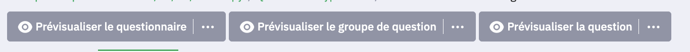

L'aperçu du questionnaire complet ne compte pas de réponse réelle et ne nécessite pas d'activer le questionnaire : vous pouvez le lancer autant de fois que nécessaire pendant la construction.

### Lire les repères contributeur

Dans l'aperçu, gardez en tête la règle centrale du guide et relisez chaque question avec cette grille :

- **Le libellé de question est un titre.** Il doit apparaître court, clair, en haut de la question, sans mise en forme riche. S'il déborde, contient des listes ou plusieurs phrases explicatives, c'est qu'une partie du contenu appartient en réalité au champ **aide**.
- **L'aide porte le contenu riche.** C'est là que vivent les explications, les listes, les liens explicites et les composants DSFR (accordéon, mise en avant, etc.). Vérifiez qu'ils s'affichent au bon endroit et avec le bon sens éditorial.
- **Chaque composant a un sens, pas une décoration.** À l'écran, demandez-vous : cet accordéon contient-il bien une information *complémentaire* qu'on peut replier ? Ce badge signale-t-il bien un *statut* (par exemple « Nouveau », « Brouillon », « Clôturée ») ? Si le composant n'ajoute pas de sens, retirez-le.
- **La hiérarchie se lit du regard.** Titres de groupe, libellés de question, aides : l'ordre visuel doit refléter l'ordre logique. Un aperçu où « tout se ressemble » est un signal d'alerte.

### Le cas des composants interactifs (accordéon)

Un point important à ne pas confondre avec un bug. Dans l'écran d'**édition**, un accordéon apparaît **déplié** et inerte (vous voyez tout son contenu, c'est normal : l'éditeur montre le texte brut, sans l'interactivité).

En revanche, dans **tout aperçu** (question, groupe ou questionnaire complet) comme sur le **questionnaire activé**, l'accordéon se comporte comme prévu : il est **replié par défaut** et le répondant le **déplie en cliquant**. C'est exactement le comportement attendu — l'information complémentaire reste discrète tant qu'on ne la demande pas.

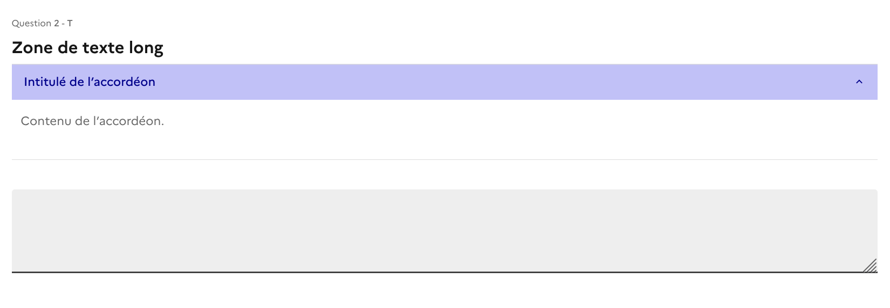

Conséquence pratique : ne jugez jamais le rendu d'un composant interactif depuis l'écran d'édition. **Seul l'aperçu (ou le questionnaire activé) montre le vrai comportement répondant.** Si vous voulez vérifier qu'une information est bien lisible une fois dépliée, cliquez réellement sur l'accordéon dans l'aperçu.

### Votre vérification avant activation

À faire au minimum une fois, sur l'aperçu du questionnaire complet :

1. **Réglez la déclaration de conformité RGAA sur votre niveau réel** (voir l'encadré ci-dessus) : ne laissez jamais « Totalement conforme » par défaut.
2. **Parcourez tout le questionnaire de bout en bout**, comme un répondant, sans sauter de page.
3. **Cliquez sur chaque composant interactif** (accordéons) pour confirmer qu'il se déplie et que le contenu est correct.
4. **Vérifiez chaque libellé de question** : court, clair, en position de titre.
5. **Vérifiez chaque aide** : les composants DSFR ont un sens, les liens sont explicites.
6. **Testez sur mobile** si possible (fenêtre réduite ou téléphone) : le rendu DSFR s'adapte automatiquement, mais votre découpage de questions doit rester confortable sur petit écran.

Une fois ce parcours validé sans surprise, vous pouvez activer le questionnaire en confiance.

---

## 8. Recettes rapides

Cette section est un aide-mémoire. Vous savez ce que vous voulez obtenir, mais vous ne savez pas quel composant DSFR employer ? Cherchez votre intention dans la colonne de gauche, appliquez le composant de la colonne de droite. Le détail du sens de chaque composant vit à la section 6 (Mises en forme et composants DSFR) et à l'Annexe B (référentiel) : ici, on va à l'essentiel.

**Le principe qui gouverne toute cette section :** chaque composant DSFR porte un **sens**, jamais une simple décoration. On ne choisit pas un composant parce qu'il « rend bien » ou parce que sa couleur ressort, mais parce qu'il **dit la bonne chose**. Une information importante et durable, un message d'état que vous annoncez, une parole rapportée, un fichier à récupérer : ce sont autant d'intentions différentes, donc autant de composants différents. Utiliser le bon composant pour le bon sens, c'est déjà faire de l'accessibilité et de la clarté.

Rappel de la section 3 (Créer un questionnaire) : le **libellé de question** reste un titre court et neutre. Tous les composants ci-dessous se placent dans le **texte d'aide** de la question (ou dans un texte d'introduction de groupe), jamais dans le libellé.

### 8.1 La table « Je veux… → Utilisez… »

| Je veux… | Utilisez… | Pourquoi (le sens) |
|---|---|---|
| Mettre en avant une **information importante mais stable** à lire en priorité (durée estimée, anonymat des réponses, consigne de cadrage) | **Mise en avant** (titre + texte) | Dit « lisez ceci en priorité » : une info de fond, sans l'urgence d'une alerte. |
| Faire ressortir **une phrase-clé** dans un paragraphe déjà rédigé (ex. « Vos réponses restent anonymes ») | **Mise en exergue** | Détache un court passage par un liseré, sans changer le sens ni sonner l'alerte. |
| Ajouter une **information complémentaire repliable** que tout le monde n'a pas besoin de lire (précisions méthodologiques, mentions, modalités) | **Accordéon** dans le texte d'aide | Signale « contenu secondaire, à consulter à la demande ». Allège la page sans masquer l'essentiel. |
| Construire une **FAQ** ou une page d'aide (une liste de questions/réponses) | **Accordéon** (un pli par question) | Chaque en-tête est une vraie question autoporteuse ; le répondant n'ouvre que celle qui le concerne. |
| Afficher un **message d'état statique que vous maîtrisez**, à lire sans action (contexte de collecte, mode brouillon) | **Alerte — information** | Le bleu = contexte neutre. À réserver au moment utile, pas en permanence. |
| Prévenir d'une **échéance ou d'une conséquence** que vous annoncez vous-même (ex. « La collecte se termine le 30 juin ») | **Alerte — avertissement** | Attire l'attention, au bon moment, sur ce qui va se passer. |
| Reproduire un **verbatim ou une parole attribuée** (témoignage, déclaration officielle, extrait de texte de référence) | **Citation** | « quelqu'un a dit ou écrit ceci », avec sa source : engagement de fidélité aux mots exacts. |
| Présenter des **données comparables** (liste de campagnes avec statut et dates, résultats par question) | **Tableau** | Les lignes se comparent entre elles, colonne à colonne. |
| Proposer un **document à télécharger** (notice à remplir, règlement, modèle de courrier) | **Téléchargement de fichier** | Annonce avant le clic ce que le répondant va récupérer : intitulé, format et poids du fichier. |
| Signaler un **statut court** (« Nouveau », « Brouillon », « Clôturée ») | **Badge** (voir section 6), avec parcimonie | Marque un état en un ou deux mots. Trois variantes seulement : information (bleu), succès (vert), nouveau. |

> **⚠️ N'écrivez jamais « en dur » les messages que LimeSurvey produit seul.** Les confirmations d'enregistrement, les erreurs de validation et les rappels de champ obligatoire manquant sont générés **automatiquement** par LimeSurvey et le thème, au bon endroit et de façon accessible. Le caractère obligatoire d'une question, en particulier, est déjà signalé nativement (astérisque + mention) : n'ajoutez pas de badge ni d'alerte pour le rappeler. Une **alerte** que vous insérez sert uniquement à un **message d'état statique que vous maîtrisez** (ex. « La collecte se termine le 30 juin »).

### 8.2 Les confusions les plus fréquentes (et comment trancher)

Plusieurs composants se ressemblent en apparence mais ne disent pas la même chose. Posez-vous **une seule question** pour choisir :

- Est-ce un **message d'état statique que vous maîtrisez**, à lire sans action (échéance, contexte de collecte) ? → **Alerte** (les confirmations et les erreurs, elles, sont automatiques ; ne les recopiez pas).
- Est-ce une **information de fond, importante et durable** ? → **Mise en avant** (composant autonome) ou **Mise en exergue** (une phrase dans un paragraphe).
- Est-ce une **parole rapportée, avec un auteur** ? → **Citation**.
- Est-ce un **contenu secondaire, optionnel, qu'on peut replier** ? → **Accordéon**.
- Est-ce un **simple statut en un mot** ? → **Badge**.

Exemples de choix corrects :

- « Vos réponses restent anonymes » avant un module sensible → **Mise en avant** (ou **Mise en exergue** si c'est une phrase dans un texte existant). *Pas* une alerte : ce n'est ni une erreur, ni un événement.
- « La collecte se termine le 30 juin » → **Alerte — avertissement**. *Pas* une mise en avant : c'est une échéance qui appelle l'attention au bon moment.
- « Répondez en pensant aux 12 derniers mois » → **Mise en avant**. *Pas* une citation : personne ne prononce cette phrase.
- Une consigne indispensable pour répondre (« Indiquez le montant en euros, sans les centimes ») → **texte d'aide visible**. *Pas* un accordéon : ce qui est nécessaire pour répondre ne se replie jamais.
- « Notice d'aide au remplissage (PDF – 1,7 Mo) » → **Téléchargement de fichier**. *Pas* un lien nu : le format et le poids font partie du sens.

### 8.3 Les réflexes à garder

- **Parcimonie.** Les composants d'accentuation (mise en avant, mise en exergue, alerte, badge, citation) perdent tout leur pouvoir si on les multiplie. **Un, exceptionnellement deux par écran** : si tout ressort, plus rien ne ressort.
- **Jamais dans le libellé.** Ces composants vivent dans le texte d'aide, pas dans le libellé de question.
- **Ne jamais replier une consigne indispensable** dans un accordéon : ce qui est nécessaire pour répondre doit rester visible.
- **Plusieurs accordéons au même endroit ?** Le plus simple est de les répartir dans des aides de questions différentes. Pour en placer plusieurs au même endroit, demandez à votre référent thème / webmestre.
- **Ne recopiez jamais en dur les messages automatiques** (confirmation d'enregistrement, erreur de validation, champ obligatoire manquant) : LimeSurvey et le thème s'en chargent.
- **La couleur porte un sens.** On ne choisit pas « rouge parce que ça se voit » : le type d'alerte et la variante d'un badge encodent un message normé. Un badge reste lisible par son seul libellé (voir section 4).
- **En cas de doute**, revenez à la section 6 pour le détail de chaque composant, ou à l'Annexe B (référentiel).

---

## 9. Pièges et FAQ

Cette section répond aux surprises les plus fréquentes rencontrées par les gestionnaires d'enquêtes. Dans presque tous les cas, ce qui ressemble à un bug est en réalité **une règle du thème DSFR qui fait son travail** : garantir un rendu accessible (RGAA) et conforme à la charte de l'État, quelle que soit la façon dont le contenu a été saisi. Voici comment obtenir le résultat voulu **dans les règles**.

### « J'avais mis ma phrase en rouge / en vert, et la couleur a disparu »

**Ce qui se passe.** Le thème DSFR **normalise les couleurs de texte**. Les couleurs libres appliquées à la main (via la palette de couleurs de l'éditeur ou héritées d'un texte collé depuis Word) sont retirées à l'affichage. C'est voulu : une couleur choisie au hasard n'a pas de sens pour un lecteur d'écran, peut devenir illisible en mode sombre et casse la charte.

**Pourquoi.** En accessibilité, **la couleur seule ne doit jamais porter une information**. « Le champ en rouge est obligatoire » est invisible pour une personne daltonienne ou aveugle. Le DSFR impose donc de faire passer le sens par autre chose que la teinte.

**Ce qu'il faut faire à la place** — utilisez un **composant qui porte le sens** :

- Pour attirer l'attention sur une consigne importante → une **mise en avant** ou une **alerte** (voir section 6).
- Pour signaler un statut → un **badge** (« Nouveau », « Brouillon », « Clôturée »), avec parcimonie. Inutile d'ajouter un badge « Obligatoire » : le caractère obligatoire d'une question est déjà géré par LimeSurvey (astérisque et mention).
- Pour un simple accent dans une phrase → le **gras**, via le menu de l'éditeur.

Le résultat est alors coloré **et** compréhensible par tous, et il reste conforme même quand la charte évolue.

### « Mon tableau ne rentre pas dans le libellé de la question »

**Ce qui se passe.** Vous avez collé un tableau (ou une liste à puces, ou un paragraphe riche) dans le **libellé** de la question, et il s'affiche mal, écrasé ou tronqué.

**Pourquoi.** Rappel de la règle d'or du guide (voir section 3) : **le libellé de question est un titre**. Il est transformé en **titre court** : un titre ne peut pas contenir de tableau, pas plus qu'un titre de journal ne contient un graphique. C'est ce qui garantit une navigation propre au clavier et au lecteur d'écran, question après question.

**Ce qu'il faut faire à la place.** Déplacez le tableau (et tout contenu riche : listes, accordéons, composants) dans le champ **Aide** de la question. L'aide, elle, accepte la mise en forme riche et les composants DSFR. Gardez dans le libellé **la question elle-même, en une phrase courte**.

> Exemple. Libellé de question : « Quel montant avez-vous déclaré pour chaque trimestre ? » — et le **tableau récapitulatif des trimestres** va dans l'aide, juste en dessous.

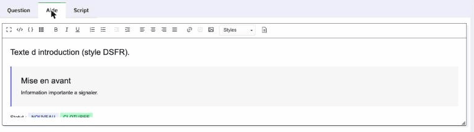

### « Mon accordéon s'affiche tout déplié, ou ne réagit pas au clic »

**Ce qui se passe.** Vous regardez l'accordéon dans l'**écran d'édition** : il y apparaît déplié et inerte, car l'éditeur montre le contenu brut, sans l'interactivité. Il n'y a rien à corriger.

**Ce qu'il faut faire.** Jugez toujours un composant interactif dans un **aperçu** (question, groupe ou questionnaire complet) ou sur le questionnaire **activé** : l'accordéon y est replié par défaut et se déplie au clic. Ce cas est détaillé en section 7 (Prévisualiser et vérifier). Si l'accordéon reste inerte **même en aperçu**, voyez le piège suivant (filtre de sécurité).

### « Un composant fonctionne chez l'administrateur, mais pas chez moi »

**Ce qui se passe.** Vous insérez un accordéon ou une mise en exergue correctement, mais après enregistrement le composant perd sa mise en forme, disparaît ou reste inerte — alors que la même manipulation fonctionne sur le compte de votre administrateur.

**Pourquoi.** LimeSurvey applique un **filtrage de sécurité (dit « filtre XSS »)** au contenu saisi par les comptes qui ne sont pas superadministrateurs. Selon la configuration de la plateforme, ce filtre peut retirer des éléments nécessaires aux composants DSFR.

**Ce qu'il faut faire.** Ce n'est ni une erreur de votre part, ni réparable depuis l'éditeur : c'est un réglage de la plateforme. Signalez-le à votre **administrateur LimeSurvey** ou à votre référent thème (le point est documenté pour lui en Annexe A.4).

### « J'ai écrit un long texte d'introduction, mais il s'affiche aplati / sans mise en forme »

**Ce qui se passe.** Vous avez saisi plusieurs paragraphes, des retours à la ligne ou de la mise en forme dans le **libellé** d'une question, et tout ressort collé sur une seule ligne, sans les styles.

**Pourquoi.** Même règle que pour le tableau : **le libellé de question est un titre**, donc **aplati en texte court**. Les paragraphes et la mise en forme y sont volontairement supprimés.

**Ce qu'il faut faire à la place.** Deux cas :

- **Texte d'introduction / consigne longue attachée à une question** → mettez-le dans le champ **Aide**, qui conserve paragraphes et mise en forme riche.
- **Bloc d'introduction général** (avant tout un groupe de questions) → utilisez une **question de type « Texte d'affichage »** dédiée, prévue exactement pour présenter du contenu éditorial riche.

Gardez le libellé pour **la question, en une phrase**.

### En bref

| Symptôme | Cause | Solution |
| --- | --- | --- |
| Ma couleur a disparu | Normalisation DSFR du texte | Utilisez une alerte, une mise en avant ou un badge (voir section 6) |
| Mon tableau est écrasé | Il est dans le **libellé** (= titre) | Déplacez-le dans l'**aide** |
| Mon accordéon est déplié / inerte | Vous le regardez dans l'**éditeur** (contenu brut) | Jugez-le en **aperçu** ou sur le questionnaire **activé** (voir section 7) |
| Un composant disparaît chez moi, pas chez l'admin | Filtre de sécurité (XSS) des comptes non-superadmin | À signaler à l'**administrateur** (voir Annexe A.4) |
| Mon texte long est aplati | Il est dans le **libellé** (= titre) | Aide, ou question « Texte d'affichage » |

**Le fil rouge :** le **libellé de question** porte la question (court, un titre) ; l'**aide** et les **questions Texte d'affichage** portent le contenu riche ; et le **sens** (attention, statut, alerte) passe par un **composant DSFR**, jamais par une couleur posée à la main. Si un doute persiste, voyez la section 10 (Aide et remontées).

---

## 10. Aide et remontées

Vous n'êtes pas seul. Le thème DSFR est un outil vivant : il évolue, il se corrige, et vos retours font partie de cette évolution. Cette section explique **où chercher de l'aide**, **comment signaler un problème** et surtout **par quel canal**, selon que votre demande est publique ou sensible.

### 10.1 Avant de demander : les trois réflexes

Neuf fois sur dix, la réponse est déjà à portée de main. Avant de solliciter qui que ce soit, prenez trente secondes pour :

1. **Relire la recette correspondante** — la section 8 (Recettes rapides) couvre les besoins courants (« je veux… → utilisez… »).
2. **Consulter les pièges et la FAQ** — la section 9 (Pièges et FAQ) rassemble les questions qui reviennent le plus souvent (un composant qui ne s'affiche pas, une mise en forme qui « saute », etc.).
3. **Prévisualiser à nouveau** — la section 7 (Prévisualiser et vérifier) rappelle comment vérifier le rendu réel. Beaucoup de « bugs » sont en fait un aperçu regardé au mauvais endroit (éditeur au lieu du questionnaire publié).

Si le doute persiste, passez à la suite.

### 10.2 Distinguer le public du sensible

C'est **le point le plus important de cette section**. Toutes les demandes ne se remontent pas au même endroit, parce qu'elles ne contiennent pas les mêmes informations.

- **Public** — une question sur le fonctionnement du thème, une anomalie d'affichage reproductible sur un questionnaire de démonstration, une idée d'amélioration. Rien de tout cela n'expose de données. Ces demandes ont vocation à être **partagées ouvertement**, car elles profitent à tous les gestionnaires.
- **Interne / sensible** — tout ce qui montre **le contenu réel d'un questionnaire** : une capture d'écran de vos questions, un lien vers votre questionnaire en préparation, une liste de répondants, des libellés de question qui révèlent un sujet non encore public. Ces éléments **ne doivent jamais** être publiés sur un canal ouvert.

> **Règle simple** : si votre demande nécessite de **montrer votre questionnaire** (capture, export, lien privé), elle est interne. Si vous pouvez la formuler avec un exemple neutre (« un accordéon dans l'aide d'une question à choix multiple ne s'ouvre pas »), elle peut être publique.

### 10.3 Le canal public : le dépôt GitHub du thème

Pour tout ce qui est **non sensible**, le thème dispose d'un espace de suivi public :

**`https://github.com/mef-snum-miweb/limesurvey-theme-dsfr`** — onglet **« Issues »**.

C'est là que se déclarent les bugs et les demandes d'évolution du thème lui-même. Une « issue » (prononcez « i-chou ») est simplement un ticket : un titre, une description, et un fil de discussion.

> **Le thème ou l'éditeur ?** Si votre remontée concerne l'**éditeur de texte** (menu Styles, palette Modèles), elle relève du plugin **CKEditorDSFR**, qui a son propre dépôt : **`https://github.com/mef-snum-miweb/limesurvey-ckeditor-dsfr`** — onglet « Issues » également. Dans le doute, postez sur le dépôt du thème : les mainteneurs réorienteront.

Vous n'êtes pas développeur, et ce n'est pas grave : une bonne remontée tient en quelques lignes claires. Décrivez **ce que vous attendiez**, **ce que vous avez obtenu**, et **comment le reproduire**. Par exemple :

> **Titre** : L'accordéon dans l'aide d'une question ne s'ouvre pas au clic
>
> **Ce que je faisais** : j'ai inséré un bloc « Accordéon » (palette **Modèles**) dans le champ *Aide* d'une question à choix unique.
> **Attendu** : le titre de l'accordéon se déplie quand on clique dessus.
> **Obtenu** : rien ne se passe au clic, en aperçu comme en questionnaire publié.
> **Contexte** : LimeSurvey 6.16, thème DSFR, navigateur Firefox.

Remarquez : cet exemple **ne montre aucune donnée de questionnaire**. Il décrit un comportement du thème avec un cas neutre. C'est exactement ce qui peut vivre en public.

Avant de créer un ticket, **jetez un œil aux tickets existants** : votre problème est peut-être déjà signalé. Dans ce cas, ajoutez plutôt un commentaire (« même souci de mon côté ») — c'est plus utile qu'un doublon.

### 10.4 Le canal interne : pour tout ce qui touche à votre questionnaire

Dès que vous devez **joindre une capture de votre questionnaire**, partager un **lien privé**, ou évoquer un **contenu non public**, ne passez pas par GitHub. Utilisez le **canal interne de votre organisation**.

Concrètement, selon ce qui est en place chez vous, cela peut être :

- votre **référent thème DSFR** ou votre **webmestre** (la personne qui a installé le thème et le plugin CKEditorDSFR — voir Annexe A) ;
- l'**assistance / support interne** de votre structure (adresse de messagerie dédiée, portail de tickets) ;
- l'**espace d'échange métier** de votre équipe enquêtes (messagerie instantanée interne, liste de diffusion).

> **À faire renseigner par votre administrateur** : l'adresse ou l'outil exact du support interne à contacter. Si vous ne le connaissez pas, demandez à la personne qui gère LimeSurvey dans votre organisation — c'est le bon point d'entrée.

Sur ce canal interne, vous pouvez transmettre sans risque une capture d'écran de votre question, l'identifiant de votre questionnaire ou un lien d'aperçu : ces informations restent dans le périmètre de confiance de votre structure.

### 10.5 En résumé

| Votre demande… | Canal | Exemple |
|---|---|---|
| Question générale sur le thème, bug reproductible sans données, idée d'évolution | **GitHub — Issues** (public) | « Le badge "Clôturée" ne s'affiche pas dans l'aide d'une question » |
| Nécessite de montrer votre questionnaire (capture, lien privé, contenu confidentiel) | **Support interne** de votre organisation | « Ce composant s'affiche mal dans *mon* questionnaire X » |
| Blocage urgent qui empêche une mise en ligne | **Support interne** en priorité | « Impossible de publier avant demain » |

Dans le doute, **passez par l'interne** : votre référent saura, si besoin, reformuler votre demande en un ticket public neutre, débarrassé de toute donnée sensible. Mieux vaut une remontée bien orientée qu'une donnée exposée.

Et surtout : **n'hésitez pas**. Un affichage qui vous semble bizarre, une formulation de cette documentation qui n'est pas claire, un composant dont vous ne voyez pas l'usage — tout retour est bon à prendre. C'est ainsi que le thème et ce guide s'améliorent.

---

## Annexe A — Mise en place (administrateur)

> Cette annexe s'adresse à l'administrateur de la plateforme LimeSurvey (profil technique / superadministrateur), **pas** au gestionnaire d'enquête. Elle décrit les trois opérations à réaliser **une seule fois** pour que les contributeurs disposent du thème DSFR et de l'éditeur enrichi décrits dans ce guide.

Trois étapes, dans l'ordre :

1. Déposer le thème DSFR sur le serveur.
2. Activer le thème sur le questionnaire concerné.
3. Activer le plugin **CKEditorDSFR** qui fournit les composants et mises en forme DSFR de l'éditeur.

Les fichiers se récupèrent depuis les dépôts GitHub officiels : [`limesurvey-theme-dsfr`](https://github.com/mef-snum-miweb/limesurvey-theme-dsfr) pour le thème et [`limesurvey-ckeditor-dsfr`](https://github.com/mef-snum-miweb/limesurvey-ckeditor-dsfr) pour le plugin (le dépôt d'ensemble [`limesurvey-dsfr-suite`](https://github.com/mef-snum-miweb/limesurvey-dsfr-suite) fournit en outre un environnement Docker de démonstration et de test). La suite est testée avec **LimeSurvey 6.16** ; la compatibilité avec LimeSurvey 7 est déclarée par les modules.

### A.1 Déposer le thème DSFR

Le dépôt par le **système de fichiers** (filesystem) est la méthode **recommandée** : elle est plus fiable que l'import d'une archive via l'interface web et facilite les mises à jour ultérieures.

Concrètement, placez le dossier du thème dans le répertoire des **thèmes utilisateur** de votre installation LimeSurvey — `upload/themes/survey/` — et non dans `themes/survey/`, réservé aux thèmes du cœur et écrasé lors des mises à jour de LimeSurvey. Laissez ensuite LimeSurvey le détecter : le thème apparaît dans la liste des thèmes disponibles côté administration.

> Pourquoi le filesystem plutôt que l'upload ? Parce qu'une mise à jour du thème (nouvelle version) se résume alors à remplacer les fichiers sur le serveur, sans manipulation dans l'interface et sans risque d'écraser une personnalisation par erreur.

### A.2 Activer le thème sur le questionnaire

Le thème se choisit **questionnaire par questionnaire** : déposer les fichiers ne l'applique pas automatiquement. Ouvrez le questionnaire voulu, puis sélectionnez le thème DSFR dans **Paramètres › Général**, champ **« Thème »**.

Une fois le thème sélectionné, prévisualisez le questionnaire pour confirmer que la charte DSFR s'affiche bien (en-tête, typographie Marianne, couleurs de l'État). Les **options** du thème (bandeau, pied de page, etc.) sont ensuite réglées par le gestionnaire comme décrit en **section 2** de ce guide.

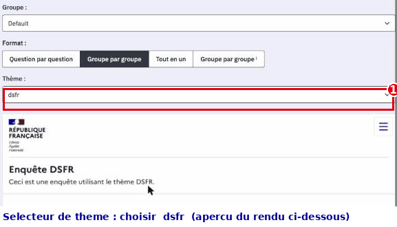

### A.3 Activer le plugin CKEditorDSFR

Le plugin **CKEditorDSFR** est ce qui met à disposition, dans l'éditeur de texte des questions et des textes d'aide, le menu **Styles** et la palette **Modèles** (bouton *Templates* de l'éditeur) de composants DSFR (accordéon, mise en exergue, badge, etc.) présentés en section 6 et Annexe B. **Sans ce plugin, le contributeur ne voit pas ces composants.**

Marche à suivre dans l'administration LimeSurvey :

1. Aller dans **Configuration > Plugins**.
2. Cliquer sur **Analyser les fichiers** (LimeSurvey détecte le plugin déposé).
3. Cliquer sur **Installer** en regard de *CKEditorDSFR*.
4. Cliquer sur **Activer**.

Après activation, ouvrez une question en édition et vérifiez que le menu **Styles** et le bouton **Modèles** apparaissent dans la barre d'outils de l'éditeur.

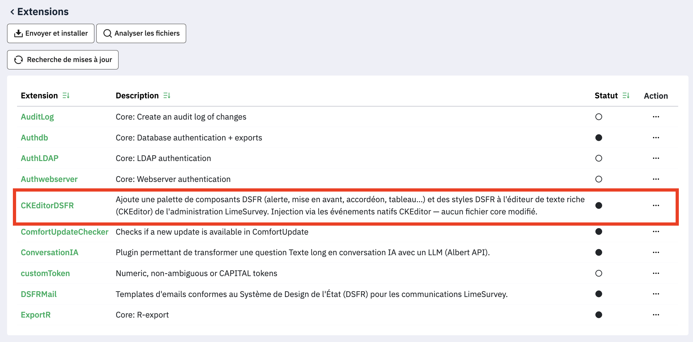

### A.4 Point de vigilance — filtre XSS et contributeurs non-superadmin

LimeSurvey applique par défaut un **filtrage XSS** du HTML saisi dans les éditeurs pour les utilisateurs qui **ne sont pas superadministrateurs**. Ce filtre peut retirer certains attributs ou balises utilisés par les composants DSFR, et donc « casser » un composant pourtant inséré correctement par un gestionnaire.

**Ce point est à trancher au niveau de la configuration LimeSurvey**, en fonction de votre politique de sécurité :

- soit accorder aux gestionnaires concernés un profil/permission qui n'applique pas le filtrage (au prix d'une confiance accrue accordée à ces comptes),
- soit conserver le filtrage et **vérifier** que le rendu des composants DSFR reste correct pour un contributeur non-superadmin.

Recommandation pratique : après la mise en place, **testez le rendu avec un compte gestionnaire réel** (non superadmin) en insérant un accordéon et une mise en exergue, puis en prévisualisant. Si un composant disparaît ou perd sa mise en forme, le filtre XSS en est la cause probable.

> À retenir pour le support : un composant DSFR qui « disparaît » chez un contributeur mais fonctionne chez l'administrateur est presque toujours un symptôme du filtre XSS lié au profil du compte — voir la section 9 (Pièges et FAQ).

---

## Annexe B — Référentiel des composants DSFR

Cette annexe est votre aide-mémoire. Pour chaque composant proposé par l'éditeur — via la palette **Modèles** (bouton *Templates* de l'éditeur) ou le menu **Styles** — elle rappelle en une fiche courte : ce qu'il **veut dire** (son sens), **à quoi il sert**, **ce qu'il ne faut PAS lui faire porter**, et **où** l'utiliser dans une question (libellé de question, introduction ou aide).

Le **sens détaillé** de chaque composant est développé à la section 6 (Mises en forme et composants DSFR) ; la section 8 (Recettes rapides) donne l'aide-mémoire « intention → composant ». Cette annexe condense l'essentiel en fiches, chacune complétée du lien vers la documentation officielle.

**Rappel du principe transverse.** Un composant DSFR n'est jamais décoratif : il porte un sens éditorial. On ne choisit pas un composant « parce qu'il est joli » ou « parce que ça se voit », mais parce que son sens correspond au vôtre. Et tous ces composants d'accentuation (mise en avant, exergue, alerte, badge, citation) tirent leur force de leur **rareté** : si tout est mis en avant, plus rien ne l'est.

**Rappel du placement.** Le **libellé de question** reste un titre court et aplati (voir la section 3, Créer un questionnaire) : on n'y met pas de composant. Les composants riches ci-dessous se placent dans l'**aide** de la question ou dans un **texte d'introduction** de groupe ou de questionnaire.

> **Note.** Plusieurs fiches officielles du systeme-de-design.gouv.fr étaient temporairement inaccessibles au moment de la rédaction. Les liens vers la documentation officielle restent la référence à jour : en cas de doute, vérifiez-y les libellés et variantes exacts.

### B.1 Accordéon

- **Sens :** « contenu secondaire, consultable à la demande ». Des en-têtes cliquables que le répondant déplie s'il le souhaite.
- **À utiliser pour :** une FAQ (questions/réponses repliées), des précisions méthodologiques ou mentions que tout le monde n'a pas besoin de lire, découper un contenu long en sections navigables, alléger une page sur mobile.
- **À ne PAS utiliser pour :** masquer une consigne indispensable ; diffuser un message d'état, une erreur ou une confirmation (→ Alerte) ; afficher un statut court (→ Badge) ; naviguer entre pages ; replier un texte d'une ou deux phrases.
- **Où :** dans l'**aide** d'une question ou une **introduction** — jamais dans un libellé de question ni une consigne obligatoire.
- **Plusieurs accordéons au même endroit :** le plus simple est de les répartir dans des aides de questions différentes. Pour en placer plusieurs à un même endroit, demandez à votre référent thème / webmestre.
- **Dans l'éditeur :** l'accordéon apparaît déplié et inerte — c'est normal ; en aperçu comme sur le questionnaire activé, il est replié et se déplie au clic (voir la section 7, Prévisualiser et vérifier).
- **Bon réflexe :** en-têtes explicites et autoporteurs (le répondant devine le contenu sans ouvrir), au plus 6-8 plis, pas d'imbrication, pas de panneaux tous préouverts.
- 📖 [Accordéon — DSFR](https://www.systeme-de-design.gouv.fr/composants-et-modeles/composants/accordeon/)

### B.2 Alerte

- **Sens :** un message d'**état statique**, que vous maîtrisez et affichez à un moment précis du parcours. Le **type** porte le sens : information (bleu), succès (vert), avertissement (orange), erreur (rouge).
- **À utiliser pour :** annoncer une information d'état dont vous décidez le contenu — « La collecte se termine le 30 juin », période de collecte en cours, maintenance prévue, mode brouillon.
- **À ne PAS utiliser pour :** recopier en dur une confirmation d'enregistrement, une erreur de validation ou un rappel de champ obligatoire manquant — LimeSurvey et le thème les affichent **automatiquement**, ne les dupliquez jamais dans une aide ; un encart affiché en permanence (une alerte permanente n'alerte plus) ; du contenu riche ; un statut d'élément (→ Badge) ; choisir la couleur « pour que ça se voie » (le type a un sens normé).
- **Où :** au plus près de ce qu'elle concerne, au bon moment — pas en continu. La palette propose les quatre types : **information, succès, erreur, avertissement**.
- **Bon réflexe :** titre court qui résume l'état, message qui dit **quoi faire ensuite**, une seule alerte à la fois par niveau.
- 📖 [Alerte — DSFR](https://www.systeme-de-design.gouv.fr/composants-et-modeles/composants/alerte/)

### B.3 Badge

- **Sens :** un marqueur court, **non cliquable**, qui signale le **statut** d'un élément. Le menu **Styles** propose **trois badges** : information (bleu), succès (vert) et nouveau.
- **À utiliser pour :** un statut de questionnaire (« Brouillon », « Clôturée ») ; une nouveauté (« Nouveau »).
- **À ne PAS utiliser pour :** un bouton ou un lien (il n'est pas cliquable) ; un message important ou bloquant (→ Alerte) ; de la décoration ou une accroche (« Top ») ; une phrase entière (un badge = un ou deux mots) ; signaler qu'un champ est obligatoire — LimeSurvey s'en charge nativement (astérisque et mention).
- **Où :** à côté du libellé d'un élément dans une liste ou un tableau.
- **Bon réflexe :** un vocabulaire de statut cohérent partout (toujours « Clôturée », jamais tantôt « Fermée » — voir la section 4, Accessibilité éditoriale), et un sens lisible même sans la couleur.
- 📖 [Badge — DSFR](https://www.systeme-de-design.gouv.fr/composants-et-modeles/composants/badge/)

### B.4 Mise en avant

- **Sens :** « lisez ceci en priorité ». Une information importante et **stable**, complémentaire au contenu principal, sans l'urgence d'une alerte. Elle contient un **titre et un texte**, sans bouton.
- **À utiliser pour :** rappeler une consigne clé avant un module (« Répondez en pensant aux 12 derniers mois ») ; rassurer/cadrer (durée estimée, anonymat, reprise possible) ; signaler une info notable non urgente.
- **À ne PAS utiliser pour :** une erreur, une confirmation ou une info urgente (→ Alerte) ; une citation (→ Citation) ; empiler plusieurs mises en avant ; un simple encadré « pour faire joli » ; remplacer une FAQ repliable (→ Accordéon).
- **Où :** en tête d'une introduction ou dans l'aide. **Une, exceptionnellement deux par page.**
- **Bon réflexe :** titre court, texte de 2-3 phrases (une seule idée).
- 📖 [Mise en avant — DSFR](https://www.systeme-de-design.gouv.fr/composants-et-modeles/composants/mise-en-avant/)

### B.5 Mise en exergue

- **Sens :** attirer l'œil sur un **court passage important** grâce à un liseré vertical coloré, sans changer le sens ni sonner l'alerte.
- **À utiliser pour :** souligner une info clé dans une intro ou une consigne (« Vos réponses restent anonymes ») ; faire ressortir une phrase-pivot à lire avant de commencer ; mettre en avant une modalité importante mais non urgente ; aérer un texte dense.
- **À ne PAS utiliser pour :** une erreur, un blocage ou une info temporaire (→ Alerte) ; une parole attribuée (→ Citation) ; « colorer » la page ; encadrer plusieurs paragraphes ; en empiler plusieurs.
- **Où :** dans une introduction ou une aide, sur une à trois phrases. **Une, au maximum deux par écran.**
- **Bon réflexe :** un message autoportant ; pas de gras ni de majuscules à l'intérieur (le liseré suffit). Le test : « état/action à corriger ? » → Alerte ; « info de fond à retenir ? » → Exergue.
- 📖 [Mise en exergue — DSFR](https://www.systeme-de-design.gouv.fr/composants-et-modeles/composants/mise-en-exergue/)

### B.6 Citation

- **Sens :** « quelqu'un a dit/écrit ceci ». Un verbatim **exact** et **attribué** à son auteur — jamais une simple mise en forme.
- **À utiliser pour :** un témoignage de répondant clairement attribué ; une parole officielle (responsable, élu) ; un extrait fidèle d'un texte de référence (loi, rapport) ; incarner un chiffre par un témoignage.
- **À ne PAS utiliser pour :** faire ressortir un texte ordinaire « parce que c'est joli encadré » ; porter une consigne d'action (→ Exergue ou Alerte) ; inventer ou reformuler des propos ; empiler des citations décoratives.
- **Où :** dans une intro ou une page de restitution. Une ou deux par page suffisent.
- **Bon réflexe :** mot pour mot, avec l'auteur (nom, et si utile fonction/source). Sur des réponses au questionnaire, **anonymisez ou obtenez le consentement** avant d'attribuer nominativement.
- 📖 [Citation — DSFR](https://www.systeme-de-design.gouv.fr/composants-et-modeles/composants/citation/)

### B.7 Tableau

- **Sens :** organiser des **données comparables** en lignes et colonnes, pour lire et croiser des valeurs — jamais pour mettre en page.
- **À utiliser pour :** des données vraiment tabulaires (liste de questionnaires avec statut, nombre de réponses, date de clôture) ; comparer des valeurs ligne à ligne ou colonne à colonne ; un jeu où chaque colonne a un intitulé stable et chaque ligne un enregistrement homogène ; une synthèse chiffrée.
- **À ne PAS utiliser pour :** mettre en page ou aligner des blocs (→ grille de colonnes) ; une seule paire clé/valeur (→ Badge ou liste) ; un contenu narratif ou dépliable (→ Accordéon) ; imiter un graphique ; tasser des données hétérogènes.
- **Où :** dans une aide ou une page de restitution.
- **Bon réflexe :** toujours un **titre** (la légende du tableau) ; en-têtes de colonnes courts ; nombres alignés à droite, libellés à gauche ; pas de cellules fusionnées ni de tableaux imbriqués ; peu de colonnes sur mobile. Test : si vous ne pouvez pas nommer chaque colonne ni justifier que les lignes se comparent, ce n'est pas un tableau.
- 📖 [Tableau — DSFR](https://www.systeme-de-design.gouv.fr/composants-et-modeles/composants/tableau/)

### B.8 Téléchargement de fichier

- **Sens :** « voici un fichier à récupérer ». Le composant annonce **avant le clic** l'intitulé du document, son **format** et son **poids** (ex. « PDF – 1,7 Mo »).
- **À utiliser pour :** proposer un document réel et autonome (notice, règlement du questionnaire, courrier de consentement, résultats à exporter) ; tout fichier récupéré hors du navigateur ; regrouper plusieurs documents à télécharger ; donner une version imprimable/archivable.
- **À ne PAS utiliser pour :** un simple lien vers une page web ou une ancre (→ lien standard) ; un bouton d'action du questionnaire (« Envoyer mes réponses » — télécharger n'est pas soumettre) ; un lien « nu » sans format ni poids ; de la décoration.
- **Où :** dans une aide ou une intro, groupé si plusieurs fichiers d'un même contexte.
- **Bon réflexe :** un intitulé qui **décrit le document** (« Notice d'aide au remplissage »), pas l'action (« Cliquez ici ») ; conserver la mention automatique format + poids ; préciser la langue si elle diffère de la page. Règle simple : le répondant reste dans le navigateur → **lien** ; il récupère un fichier sur son appareil → **téléchargement**.
- 📖 [Téléchargement de fichier — DSFR](https://www.systeme-de-design.gouv.fr/composants-et-modeles/composants/telechargement-de-fichier/)

### B.9 Tableau récapitulatif

Aide au choix rapide. En cas d'hésitation entre deux composants voisins, la colonne « Ne pas confondre avec » tranche.

| Composant | Sens en une phrase | À utiliser pour | Ne pas confondre avec |
|---|---|---|---|
| **Accordéon** | Contenu secondaire replié, ouvert à la demande | FAQ, précisions, aide longue | Alerte (à voir sans clic) |
| **Alerte** | Message d'état statique que vous affichez (information/succès/avertissement/erreur) | Info d'état maîtrisée (collecte, clôture, maintenance) | Mise en avant (info stable), messages automatiques de LimeSurvey (confirmations, erreurs) |
| **Badge** | Statut court non cliquable (3 variantes : information, succès, nouveau) | « Brouillon », « Clôturée », « Nouveau » | Alerte (message important) |
| **Mise en avant** | Information importante et stable à lire en priorité (titre + texte) | Consigne clé, cadrage rassurant | Alerte (urgence), Citation (parole) |
| **Mise en exergue** | Court passage clé détaché par un liseré | Phrase-pivot d'une intro/consigne | Alerte (état), Citation (auteur) |
| **Citation** | Parole exacte attribuée à un auteur | Verbatim, parole officielle, extrait de loi | Exergue (message clé sans auteur) |
| **Tableau** | Données comparables en lignes/colonnes | Listes, synthèses chiffrées comparables | Grille de mise en page, graphique |
| **Téléchargement** | Fichier à récupérer (format + poids annoncés) | Notice, export, pièce à télécharger | Lien standard, bouton de soumission |

### B.10 Pour aller plus loin

Le catalogue complet, avec toutes les variantes et exemples officiels, est sur le **Système de Design de l'État** : [systeme-de-design.gouv.fr](https://www.systeme-de-design.gouv.fr/composants-et-modeles/composants/). C'est la source de vérité en cas de doute sur un libellé ou une variante.

---

